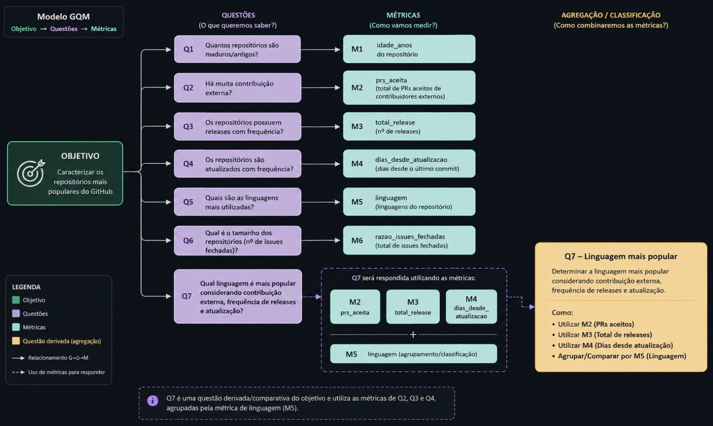
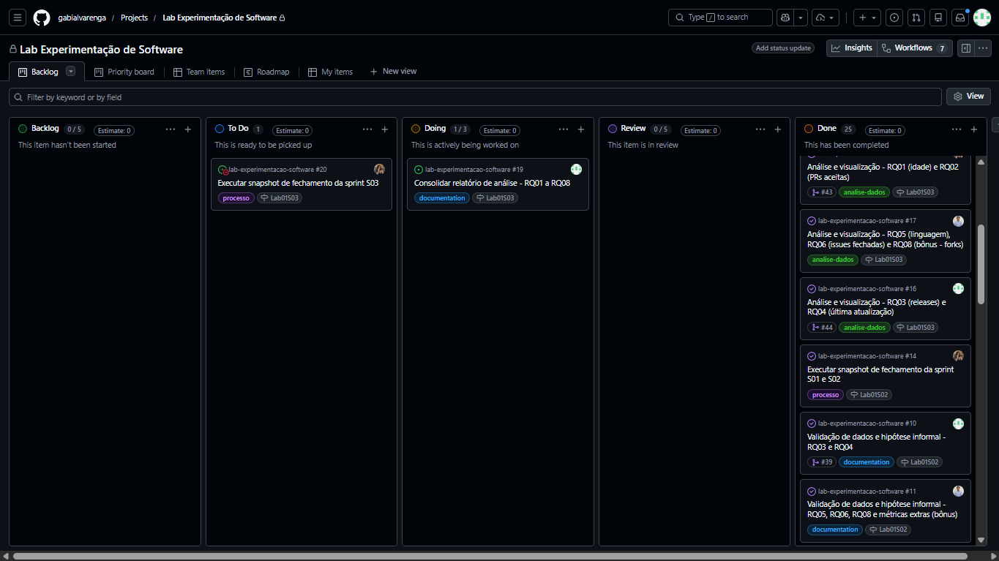
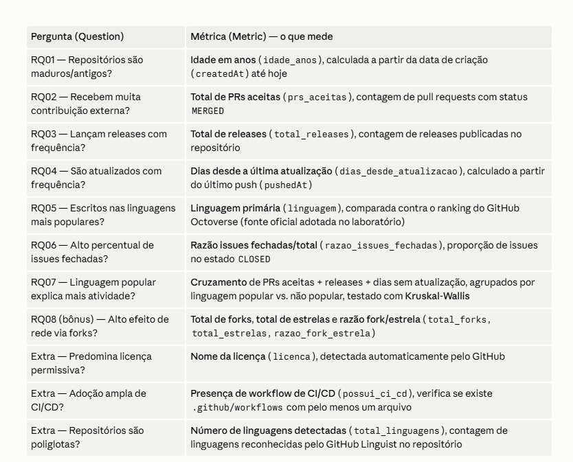

# Relatório de Laboratório

*Laboratório de Experimentação de Software*

| Curso | Engenharia de Software |
| :---- | :---- |
| **Disciplina** | Laboratório de Experimentação de Software |
| **Turno / Período** | Noite / 6º |
| **Professor(a)** | Danilo Maia |
| **Laboratório** | Lab01 — Repositorios populares \+ Setup do Kanban.md |
| **Grupo (trio)** | Brenda Evers · Gabriela Alvarenga Cardoso · Carlos José Gomes Batista Figueiredo |
| **Link do repositório / GitHub Projects** | [https://github.com/gabialvarenga/lab-experimentacao-software](https://github.com/gabialvarenga/lab-experimentacao-software) · [Board (GitHub Projects)](https://github.com/users/gabialvarenga/projects/9/views/1) |
| **Data de entrega** | 27/08/2026 |

# **1. Introdução**

Este laboratório caracteriza os 1.000 repositórios open-source mais populares do GitHub, buscando entender se popularidade anda junto com outros sinais que costumam ser associados a projetos "saudáveis": maturidade, contribuição externa, cadência de releases, atividade recente, escolha de linguagem, gestão de issues, efeito de rede via forks e práticas de engenharia, como licenciamento e CI/CD. O interesse prático é verificar se estrela é um proxy razoável para esses atributos ou se, ao contrário, mede só visibilidade acumulada, independente da saúde atual do projeto.

As questões de pesquisa investigadas, cada uma com sua hipótese informal formulada a partir da leitura das distribuições de *data/[data-quality-report.md](http://data-quality-report.md)* (detalhamento completo nas seções abaixo), são:

| RQ | Pergunta | Hipótese Informal |
| :---- | :---- | :---- |
| RQ1 | Sistemas populares são maduros/antigos? | Sustentada: mediana de ~7,7 anos, mas maturidade não é requisito rígido (mín. de 0,01 ano). |
| RQ2 | Sistemas populares recebem muita contribuição externa? | Parcialmente sustentada: mediana de ~766 PRs aceitas, mas 12,3% são outliers que concentram a maior parte da contribuição. |
| RQ3 | Sistemas populares lançam releases com frequência? | Não sustentada como afirmação única: distribuição bimodal, 28% nunca usa Releases, o resto lança com frequência alta. |
| RQ4 | Sistemas populares são atualizados com frequência? | Sustentada para a maioria: mediana de 3 dias sem push com 19,1% de exceções para projetos descontinuados. |
| RQ5 | Sistemas populares são escritos nas linguagens mais populares? | Sustentada: Python, TypeScript e JavaScript no topo, coerentes com o ranking do GitHub Octoverse. |
| RQ6 | Sistemas populares possuem um alto percentual de issues fechadas? | Sustentada com folga: mediana de 86% de issues fechadas. |
| RQ7 | Sistemas escritos nas linguagens mais populares recebem mais contribuição externa, lançam mais releases e são atualizados com mais frequência? | Não sustentada nesta amostra: PRs, releases e dias sem atualização praticamente idênticos entre os dois grupos (Kruskal-Wallis, p > 0,25 nas três comparações). |
| RQ8 (bônus) | Sistemas populares possuem um alto número de forks? | Sustentada parcialmente: mediana de 6.403 forks; com `stargazerCount` incluído à coleta (Issue #54), a razão fork/estrela tem mediana de 0,11, cerca de 1 fork a cada 9 estrelas, mas varia mais de 2.100 vezes entre repositórios-tutorial, onde o fork é o próprio produto, e bibliotecas consumidas via gerenciador de pacotes. |

Além das oito questões acima, sete do enunciado e a RQ8 bônus, foram coletadas três métricas extras de maturidade de engenharia: licença, presença de CI/CD e número de linguagens por repositório. Essas métricas, tratadas na Issue #26 como parte da fatia de inovação do laboratório na seção 3.6, são numeradas informalmente como RQ09 a RQ11 nos documentos de análise.

A leitura consolidada dos onze sinais é que a popularidade por estrelas correlaciona com maturidade e boas práticas de engenharia, mas não as exige. Em cada RQ existe uma minoria relevante de repositórios populares que rompe o padrão: em RQ01, projetos jovens virais; em RQ02, mega-projetos que concentram a contribuição; em RQ03, repositórios de conteúdo sem releases nem PRs; em RQ04, projetos descontinuados que ainda carregam estrelas antigas; em RQ07, o efeito da linguagem desaparece dentro do recorte já filtrado do top 1000. Isso reforça a leitura de estrela como indicador de relevância histórica acumulada, não necessariamente de estado corrente do projeto. O detalhamento completo de cada RQ está nas seções abaixo.

# **2. Contexto**

Este relatório documenta o Lab01 da disciplina de Laboratório de Experimentação de Software, na PUC Minas, sob orientação do prof. Danilo Maia, o primeiro dos cinco laboratórios do semestre. Por ser o ponto de partida da disciplina, não há um laboratório anterior a conectar. Por outro lado, é este laboratório que cria as convenções usadas depois: o board Kanban no GitHub Projects e a rotina de snapshots por sprint, iniciada na Issue #13, continuam sendo usados da mesma forma nos laboratórios seguintes.

O objeto de estudo são os 1.000 repositórios open-source mais populares do GitHub, medidos por número de estrelas. A escolha de estrela como critério de popularidade segue a convenção usual da comunidade GitHub para repositório relevante, e é o eixo em torno do qual todas as questões de pesquisa giram: se esse tipo de popularidade também se traduz em maturidade, contribuição externa ativa, cadência de entrega e práticas de engenharia. Como referência conceitual para linguagem de programação popular, necessária para RQ05, RQ06 e RQ07, adotou-se o ranking do GitHub Octoverse. Essa fonte foi fixada desde a Issue #3 e mantida sem troca até o fim da coleta, para evitar inconsistência entre RQs que dependem do mesmo tipo de comparação.

# **3. Metodologia**

A investigação foi estruturada seguindo o modelo Goal-Question-Metric (GQM): a partir de um único objetivo, caracterizar os repositórios mais populares do GitHub, derivaram-se as questões de pesquisa e, para cada uma, uma métrica operacional de coleta. A RQ07 é uma questão derivada, construída a partir das métricas já usadas em RQ02, RQ03 e RQ04, agrupadas por linguagem. O diagrama abaixo resume essa estrutura.

## **3.1 Principais Desafios**

A engenharia da coleta em si concentrou os desafios técnicos mais reais do laboratório, documentados em detalhe em `relatorio/metodologia-coleta.md`.

**Timeout de gateway ao escalar de 100 para 1.000 repositórios (Issue #7).** A consulta usada na S01 paginava os repositórios com um único cursor, usando os parâmetros `first` e `after` da API. Ao tentar reduzir o número de requisições aumentando o tamanho de cada página, a consulta passou a falhar com erro `502 Bad Gateway`. Testes isolados mostraram que o tamanho de página sozinho não era a causa: mesmo páginas pequenas, de 25 itens, já falhavam na terceira página, por volta do repositório de número 50. O tempo de resposta cresce com a profundidade do cursor de busca, não só com o volume por página, e esse efeito se soma ao custo de resolver os oito campos aninhados usados na coleta, como issues, licença, CI/CD e linguagens, para cada repositório. A causa foi confirmada por dois testes de controle: uma busca simples, só com o nome dos repositórios, sustentou até a página 900 sem perda de desempenho, e uma busca direta por nome, sem paginação, manteve a mesma velocidade em qualquer ponto. A solução foi separar a coleta em duas fases. Primeiro, uma busca simples reúne os nomes dos repositórios, em páginas de 100. Depois, um enriquecimento em lote busca os campos completos de cada repositório por nome, dez por requisição. O resultado foram 110 requisições no total e os 1.000 repositórios coletados sem erro, usando cerca de 110 pontos de um orçamento de 5.000 pontos por hora.

**Falha de rede não coberta pelo retry existente (Issue #7).** Na primeira execução completa contra a API real, já com a correção acima e com uma repetição automática para erros HTTP temporários e de limite de requisições, o script parou no repositório de número 390 com uma falha de conexão de rede. Esse tipo de falha nunca chega a gerar uma resposta HTTP, então não era reconhecida pela lógica de repetição existente, que só verificava o código de status do erro. A solução foi isolar a chamada de rede em um tratamento próprio, marcando falhas de conexão com uma sinalização distinta e tratando-as como repetíveis, sem misturar com erros de lógica reais, como uma consulta GraphQL malformada ou a ausência do token de acesso, que continuam interrompendo a execução diretamente. Depois dessa correção, a coleta completa rodou sem nenhum erro e sem nenhuma repetição necessária.

**Ausência de histórico de mudança de status no GitHub Projects.** Assim como nos demais laboratórios do semestre, o GitHub Projects não oferece, pela API, um histórico consultável de em qual coluna um cartão esteve em cada momento. A solução adotada foi uma rotina de capturas manuais do board por sprint, criada na Issue #13, que exporta o estado atual para um arquivo CSV a cada fechamento de sprint. Os arquivos `data/snapshots/lab01-s01.csv` e `lab01-s02.csv` são o resultado dessa rotina.

**Definição e manutenção de uma fonte única para linguagem popular.** RQ05, RQ06 e RQ07 dependem de uma referência externa sobre quais linguagens de programação são mais populares. Essa fonte, o GitHub Octoverse, precisava ser escolhida uma única vez e reaproveitada sem troca em todas as RQs relacionadas, para não introduzir inconsistência entre perguntas que fazem o mesmo tipo de comparação. A decisão foi tomada na Issue #3 e está detalhada na seção 3.2.

**Limitação da própria API descoberta na análise.** Somente na etapa de análise, já na S03, identificou-se que o campo de total de releases da API do GitHub tem um teto de 1.000 para conexões muito grandes. Vinte e um repositórios do conjunto de dados ficaram exatamente nesse teto. Ao conferir três deles pela API REST, o valor real chegou a quase quatro vezes o valor coletado, como no caso do `vercel/next.js`. Não se trata de um erro do script de coleta, mas de uma limitação da própria API, que precisou ser documentada para não distorcer a leitura da RQ03.

## **3.2 Tomadas de Decisão**

* **Limite de WIP da coluna Doing: 3 itens (um por integrante do trio),** definido na Issue #6 junto com o setup inicial do board. A lógica é um cartão por pessoa: cada um dos três integrantes pode ter no máximo um cartão em Doing ao mesmo tempo. Isso impede que uma pessoa acumule várias tarefas em andamento enquanto outra fica sem trabalho para puxar, sem travar o fluxo do trio como um limite mais restrito, de 1 ou 2, travaria um time de três pessoas trabalhando em paralelo em RQs distintas.
* **Fonte para linguagem popular:** GitHub Octoverse, escolhida na Issue #3 em vez de TIOBE ou GitHub, por já refletir diretamente o comportamento de repositórios hospedados no próprio GitHub, a mesma base de onde vêm os dados coletados, e mantida como fonte única em todas as RQs que dependem desse ranking.
* **Critério de inclusão de repositórios:** a busca usa o filtro `stars:>1`, excluindo da amostra repositórios com zero ou uma estrela, tipicamente contas de teste ou forks pessoais sem uso real, sem afetar o recorte de top 1.000 por estrelas.
* **Definição operacional da razão de issues fechadas em RQ06:** quando `issues.totalCount` é zero, a métrica retorna explicitamente 0 em vez de `NaN`, para não descartar da análise repositórios que simplesmente não usam o rastreador de Issues do GitHub, como o `torvalds/linux`. O trade-off é que esses casos entram como outlier técnico na distribuição, não como sinal real de má manutenção, distinção já explicitada na hipótese informal de RQ06.
* **Estratégia de coleta em duas fases para chegar a 1.000 repositórios:** foi optado por separar a busca leve, só com os nomes, do enriquecimento em lote, com os campos completos. O custo foi mais chamadas à API no total, mas sem o risco de timeout de gateway que a paginação profunda com campos aninhados apresentava.
* **Strategy Pattern para cálculo de métricas, adotado na Issue #27:** cada métrica, de RQ01 a RQ11, foi isolada como uma implementação de `MetricStrategy`, desacoplada do script de coleta. O trade-off assumido foi aceitar uma camada extra de abstração, não estritamente necessária para uma coleta pontual, em troca de poder adicionar o RQ08 bônus e as métricas extras da Issue #26 sem alterar o núcleo de coleta já testado.
* **Ampliação do escopo de métricas na Issue #26:** decidido por coletar licença, presença de CI/CD e número de linguagens além do que o enunciado pedia, para poder caracterizar maturidade de engenharia e não só popularidade. Essa ampliação é parte da fatia de inovação detalhada na seção 3.6.

## **3.3 Etapas**

A divisão de trabalho abaixo reflete os Assignees reais de cada Issue no board, a partir da view "Team items" e agrupada por Assignee.

| Sprint | Entregas | Responsável(is) | Issues (nº) |
| :---- | :---- | :---- | :---- |
| **Lab01S01** | Consulta GraphQL para 100 repositórios (RQ01–RQ06 + RQ08 bônus) integrada em script único; setup do GitHub Projects (colunas, WIP=3, board inicial) | Gabriela Alvarenga Cardoso (#1, #5) · Brenda Evers (#2, #4) · Carlos José G. B. Figueiredo (#3, #6) | #1, #2, #3, #4, #5, #6 |
| **Lab01S02** | Paginação para 1.000 repositórios; exportação para CSV; refatoração para Strategy Pattern; métricas extras (licença, CI/CD, nº de linguagens); script de qualidade de dados; CI configurado (GitHub Actions); snapshots de fechamento de S01 e S02; hipóteses informais por RQ | Carlos José G. B. Figueiredo (#7, #8, #11, #26) · Gabriela Alvarenga Cardoso (#9, #13, #14, #27) · Brenda Evers (#10, #12, #28, #29) | #7, #8, #9, #10, #11, #12, #13, #14, #26, #27, #28, #29 |
| **Lab01S03** | Análise e visualização de RQ01–RQ08 e métricas extras, com gráficos (#15–#17, #47 concluídas); documentação da metodologia de coleta/resiliência (#48); correção da hipótese de RQ08 com `stargazerCount` (#54); consolidação do relatório final (#19, em andamento, é este documento); snapshot de fechamento da S03 (#20, pendente, ver observação abaixo) | Carlos José G. B. Figueiredo (#17, #18, #47, #48, #54)* · Gabriela Alvarenga Cardoso (#15, #20) · Brenda Evers (#16, #19) | #15, #16, #17, #18, #19, #20, #47, #48, #54 |

*\* As Issues #47, #48 e #54 não exibem rótulo de sprint na view do board consultada. Foram classificadas na S03 pelo conteúdo, de análise de métricas extras, documentação da metodologia de resiliência e correção da hipótese de RQ08 com `stargazerCount`, coerente com os documentos `relatorio/analise-extras.md`, `relatorio/metodologia-coleta.md` e `relatorio/hipoteses-informais.md` já produzidos nesta sprint.*

**Observação sobre o estado da S03 (27/08/2026):** as Issues #15 a #18, de análise e visualização por RQ, já estão concluídas, o que é confirmado pelos arquivos `relatorio/analise-*.md` e pelos onze gráficos já existentes em `relatorio/graficos/`. A Issue #19, de consolidação deste relatório, está em Doing. A Issue #20, de execução do snapshot de fechamento da S03, segue em To Do. Ou seja, a sprint ainda não foi formalmente encerrada no momento deste texto.

### Configuração do processo

* **Colunas do board:** Backlog → To Do → Doing → Review → Done. As cinco colunas mínimas exigidas pelo enunciado estão todas presentes, confirmadas na captura de tela abaixo. A coluna Review não teve nenhum cartão no momento dos snapshots de S01 e S02, o que não significa que ela não exista.
* **Política de limite de WIP:** 3 itens na coluna Doing, um por integrante do trio, definida na Issue #6. A justificativa está na seção 3.2.
* **Captura de tela do board (27/08/2026):**

*O print foi tirado com a Sprint 3 ainda em andamento. A Issue #19, de consolidação do relatório de análise, está em Doing, e a Issue #20, de execução do snapshot de fechamento da sprint S03, está em To Do. Isso reflete o fluxo real de trabalho no momento da captura, não um board organizado retroativamente para a entrega.*

## **3.4 Ferramentas**

* **Coleta de dados:** script próprio `src/collect.ts`, em TypeScript, executado via `tsx` sobre Node.js 22, consultando exclusivamente a API GraphQL v4 do GitHub. Sem bibliotecas de terceiros para a chamada à API, conforme exigido pelo enunciado. Autenticação por Personal Access Token, lido de `.env`. Saída em `data/repositories.csv`.
* **Qualidade de dados:** script próprio `scripts/data-quality.ts`, criado na Issue #28, que calcula distribuição, outliers pela regra do IQR e valores ausentes por coluna, gerando `data/data-quality-report.md`. Esse relatório é a base de todas as hipóteses informais do documento.
* **Testes e verificação de tipos:** Vitest para testes unitários, executado por `npm test`, e o compilador do TypeScript em modo `--noEmit` para checagem de tipos, executado por `npm run typecheck` ou `npm run build`.
* **Integração contínua:** GitHub Actions, configurado em `.github/workflows/ci.yml` na Issue #29, executando `npm ci`, `npm run typecheck` e `npm test` a cada push e pull request.
* **Processo e gestão:** GitHub Projects v2 como Kanban do grupo, com snapshots do board exportados por sprint via `npm run snapshot`, script criado na Issue #13, para `data/snapshots/lab01-<sprint>.csv`.
* **Análise e visualização:** scripts próprios em Python, com pandas e matplotlib, um por grupo de RQs (`analise/rq01_rq02.py`, `rq03_rq04.py`, `rq05_rq06_rq08.py`, `rq07_linguagens.py`, `rq09_rq10_rq11_extras.py`), recalculando a estatística descritiva de forma independente do script Node de qualidade de dados, como checagem cruzada.
* **Fonte de referência externa:** GitHub Octoverse, para o ranking de linguagens de programação populares usado em RQ05, RQ06 e RQ07.

## **3.5 Tabela de Métricas**

A tabela e a imagem abaixo relacionam cada questão de pesquisa à métrica correspondente, sua definição operacional exata e a ferramenta usada para coletá-la.

| RQ | Métrica | Definição Operacional | Unidade | Ferramenta / Fonte |
| :---- | :---- | :---- | :---- | :---- |
| RQ01 | Idade do repositório | Data atual menos `createdAt` | Anos | Script GraphQL (API do GitHub), campo `createdAt` |
| RQ02 | PRs aceitas | `pullRequests(states: MERGED).totalCount` | Pull requests | Script GraphQL, campo `pullRequests` |
| RQ03 | Total de releases | `releases.totalCount`, sujeito a um teto de 1.000 na própria API | Releases | Script GraphQL, campo `releases` |
| RQ04 | Dias desde a última atualização | Data atual menos `pushedAt` | Dias | Script GraphQL, campo `pushedAt` |
| RQ05 | Linguagem primária | `primaryLanguage.name`, comparada ao ranking do GitHub Octoverse | Categórica | Script GraphQL (`primaryLanguage`) e GitHub Octoverse |
| RQ06 | Razão de issues fechadas | `issues(states: CLOSED).totalCount` dividido por `issues.totalCount`, com resultado 0 quando o denominador é 0 | Razão (0–1) | Script GraphQL, campos `issues` e `closedIssues` |
| RQ07 | Contribuição, releases e atualização por grupo de linguagem | Repositórios classificados em linguagem popular, top 5 GitHub Octoverse 2025 (TypeScript, Python, JavaScript, Java, C#), ou não popular; comparação das medianas de RQ02, RQ03 e RQ04 entre os grupos via teste de Kruskal-Wallis | Não se aplica | Script Python `analise/rq07_linguagens.py` sobre `data/repositories.csv` |
| RQ08 (bônus) | Total de forks e razão fork/estrela | `forkCount`; `forkCount` dividido por `stargazerCount`, com resultado 0 quando `stargazerCount` é 0 | Forks; razão | Script GraphQL, campos `forkCount` e `stargazerCount` |
| RQ09 (extra) | Licença | `licenseInfo.name`, ou "Não informado" quando ausente | Categórica | Script GraphQL, campo `licenseInfo` |
| RQ10 (extra) | Presença de CI/CD | Verdadeiro quando existe ao menos um arquivo em `.github/workflows` no HEAD do repositório | Booleana | Script GraphQL, expressão Git `HEAD:.github/workflows` |
| RQ11 (extra) | Número de linguagens | `languages.totalCount`, linguagens detectadas pelo GitHub Linguist, incluindo build e configuração | Linguagens | Script GraphQL, campo `languages` |

## **3.6 Inovações Propostas pelo Grupo**

* **RQ08 bônus, sobre forks:** proposta na Issue #4, investigou se sistemas populares têm alto número de forks. Na coleta original, `stargazerCount` não fazia parte de `REPO_FIELDS`, então a análise ficou limitada à magnitude absoluta de forks, com mediana de 6.403. O campo foi incluído posteriormente à coleta, na Issue #54, permitindo finalmente testar a hipótese original sobre a razão fork/estrela: mediana de 0,11, cerca de 1 fork a cada 9 estrelas, mas com variação de mais de 2.100 vezes entre os extremos, concentrada num tipo específico de repositório, como tutoriais e templates feitos para serem forkados, a exemplo do `firstcontributions/first-contributions`, com razão 1,95, e não uma propriedade uniforme da popularidade. Resultado: hipótese sustentada parcialmente.
* **Métricas extras de maturidade de engenharia (Issue #26):** além das RQs obrigatórias, foram coletadas licença, presença de pipeline de CI/CD e número de linguagens por repositório, numeradas informalmente como RQ09, RQ10 e RQ11 nos documentos de análise. A motivação foi caracterizar maturidade de engenharia, e não só popularidade por estrelas. Os três sinais juntos sustentam essa leitura: 57,5% dos 1.000 repositórios usam licença permissiva, MIT ou Apache-2.0, contra apenas 9,8% de copyleft forte; quase 80%, entre 798 e 800, têm ao menos um workflow de CI/CD configurado; e a mediana de 5 linguagens por repositório reflete a complexidade de infraestrutura de um projeto maduro, como build, testes e documentação, e não fragmentação de código-fonte. O mesmo trade-off já assumido na Issue #27, com o Strategy Pattern, se repete aqui: mais campos para coletar e testar, em troca de uma leitura mais completa do que popularidade realmente significa para um repositório open-source.

# **4. Resultados**

## **4.1 Coleta de Dados**

A coleta final dos 1.000 repositórios rodou em 26/08/2026, gerando o arquivo `data/repositories.csv` com os 1.000 repositórios coletados e nenhum erro. Esse resultado veio da correção de repetição de rede aplicada na Issue #7, já que a execução anterior a essa correção havia parado no repositório de número 390. A estratégia de coleta em duas fases, com busca simples seguida de enriquecimento em lote, manteve o custo em cerca de 110 requisições e 110 pontos de limite de uso, de um orçamento de 5.000 pontos por hora.

Quanto à completude dos dados, registrada em `data/data-quality-report.md`, todas as métricas numéricas, como idade, PRs aceitas, releases, dias sem atualização, razão de issues fechadas, forks, estrelas e número de linguagens, têm zero valores ausentes nos 1.000 repositórios. Os campos são sempre retornados pela API do GitHub, mesmo quando o valor é zero. As únicas colunas com ausência real são categóricas: linguagem primária, em 87 dos 1.000 repositórios, e licença, em torno de 82 a 84. Em ambos os casos, a ausência é real, típica de listas de conteúdo e coleções que não têm uma linguagem ou licença dominante, e não uma falha de coleta.

Os outliers identificados pela regra do intervalo interquartil, por métrica, foram: idade, nenhum; PRs aceitas, de 123 a 124, ou 12,3% da amostra; total de releases, 94, ou 9,4%, incluindo os 21 repositórios no teto de 1.000 já descrito, cujo valor real chega a ser quase 4 vezes maior nos casos verificados pela API REST; dias desde a última atualização, de 191 a 198, ou 19,1%, investigados individualmente e confirmados como projetos legitimamente descontinuados, como `atom/atom` e `AFNetworking/AFNetworking`; razão de issues fechadas, de 60 a 61, ou 6%, incluindo o caso de repositórios sem rastreador de Issues, como `torvalds/linux`; forks, 95; estrelas, 82; razão fork/estrela, 54; e número de linguagens, 48. Nenhum outlier foi removido da análise. Todos foram mantidos e discutidos individualmente nas seções de discussão por RQ, por representarem casos legítimos, como projetos jovens virais, mega-projetos, conteúdo estático e repositórios descontinuados, e não erros de coleta.

Os snapshots do Kanban disponíveis são `data/snapshots/lab01-s01.csv` e `lab01-s02.csv`, ambos gerados pela Issue #14 ao final da S02. Um terceiro snapshot, de fechamento da S03, referente à Issue #20, ainda está pendente no momento deste relatório, já que a sprint segue em andamento, com a Issue #19, deste próprio relatório, ainda em Doing.

## **4.2 Visualização Gráfica**

### RQ01: Sistemas populares são maduros/antigos?

| n | Mín | Q1 | Mediana | Q3 | Máx | Média |
| ---: | ---: | ---: | ---: | ---: | ---: | ---: |
| 1.000 | 0,01 | 3,51 | 7,72 | 11,34 | 18,35 | 7,65 |

A distribuição é ampla e multimodal, sem um pico dominante único, espalhando-se de forma razoavelmente uniforme entre cerca de 2 e 15 anos. O boxplot não marca nenhum outlier, e as hastes cobrem o intervalo inteiro, de perto de 0 a 18 anos. A média, de 7,65, e a mediana, de 7,72, praticamente coincidem.

### RQ02: Sistemas populares recebem muita contribuição externa?

| n | Mín | Q1 | Mediana | Q3 | Máx | Média |
| ---: | ---: | ---: | ---: | ---: | ---: | ---: |
| 1.000 | 0 | 175 | 765,5 | 3.390 | 103.142 | 4.212,05 |

Em escala logarítmica, a distribuição toma a forma de um sino aproximadamente simétrico, o padrão log-normal, que é a assinatura estatística clássica de cauda longa. A média, de 4.212, é mais de 5 vezes a mediana, de 765,5. Essa assimetria forte é coerente com os 123 outliers detectados, 12,3% da amostra, que puxam a média muito acima do valor típico.

### RQ03: Sistemas populares lançam releases com frequência?

| n | Mín | Q1 | Mediana | Q3 | Máx | Média |
| ---: | ---: | ---: | ---: | ---: | ---: | ---: |
| 1.000 | 0 | 0 | 39,5 | 148,25 | 1.000 | 127,32 |

A barra dominante concentra-se perto de zero. O primeiro quartil é 0, ou seja, pelo menos 25% da amostra nunca usou releases, e a contagem cai rapidamente em seguida. No extremo oposto, aparece uma barra isolada exatamente em 1.000. Não é um segundo grupo natural de repositórios, mas o teto de truncamento do campo de total de releases, já explicado na seção 4.1. A mediana, de 39,5, fica bem abaixo da média, de 127,32, com 94 outliers empurrando os valores para cima.

### RQ04: Sistemas populares são atualizados com frequência?

| n | Mín | Q1 | Mediana | Q3 | Máx | Média |
| ---: | ---: | ---: | ---: | ---: | ---: | ---: |
| 1.000 | 0 | 0 | 3 | 49 | 2.448 | 113,37 |

A barra dominante concentra-se entre 0 e 1 dia, com 339 repositórios atualizados no próprio dia da coleta. A contagem cai abruptamente a partir daí e se dissipa ao longo de uma cauda longa, até 2.448 dias, quase 6,7 anos. A mediana é de 3 dias, contra uma média de 113,37, quase 38 vezes maior.

### RQ05: Sistemas populares são escritos nas linguagens mais populares?

| Categoria | Contagem |
| :---- | ---: |
| Python | 229 |
| TypeScript | 174 |
| JavaScript | 110 |
| Go | 76 |
| Rust | 57 |
| *(demais 38 categorias)* | 267 |
| **Não informado** | 87 |

Python, TypeScript e JavaScript ocupam as três primeiras posições, exatamente como no GitHub Octoverse, e juntas somam 513 dos 1.000 repositórios, 51,3% da amostra.

### RQ06: Sistemas populares possuem um alto percentual de issues fechadas?

| n | Mín | Q1 | Mediana | Q3 | Máx | Média |
| ---: | ---: | ---: | ---: | ---: | ---: | ---: |
| 1.000 | 0,00 | 0,67 | 0,86 | 0,97 | 1,00 | 0,77 |

O último intervalo do histograma, entre 0,95 e 1,0, sozinho reúne mais de 230 repositórios. Um pico isolado aparece bem em 0,0, com 43 repositórios, formando um grupo distinto, não uma cauda contínua. Isso é coerente com repositórios sem rastreador de Issues, como o `torvalds/linux`.

### RQ07: Sistemas escritos nas linguagens mais populares recebem mais contribuição, lançam mais releases e são atualizados com mais frequência?

A classificação usou o GitHub Octoverse 2025, considerando as cinco linguagens com mais contribuidores: TypeScript, Python, JavaScript, Java e C#. Os 87 repositórios sem linguagem informada foram excluídos desta comparação:

| Grupo | n |
| :---- | ---: |
| Populares | 562 |
| Não populares | 351 |

| Métrica | Populares (mediana) | Não populares (mediana) | Kruskal-Wallis (H) | p-valor |
| :---- | ---: | ---: | ---: | ---: |
| PRs aceitas (RQ02) | 927 | 915 | 0,06 | 0,810 |
| Total de releases (RQ03) | 54 | 48 | 1,31 | 0,253 |
| Dias sem atualização (RQ04) | 2 | 2 | 0,19 | 0,666 |

### RQ08 (bônus): Sistemas populares possuem um alto número de forks?

| Métrica | n | Mín | Q1 | Mediana | Q3 | Máx | Média |
| :---- | ---: | ---: | ---: | ---: | ---: | ---: | ---: |
| Total de forks | 1.000 | 38 | 3.624,5 | 6.403 | 10.915,5 | 108.902 | 9.980,71 |
| Razão fork/estrela | 1.000 | 0,0009 | 0,0770 | 0,1146 | 0,1797 | 1,9474 | 0,1459 |

No extremo superior estão `firstcontributions/first-contributions`, com razão 1,95, e `eugenp/tutorials`, com razão 1,43, ambos repositórios de tutorial ou prática feitos para serem forkados. No extremo inferior está `hexojs/hexo`, com razão 0,0009, consumido via `npm install` e raramente clonado.

### RQ09 (extra): Licença

| Categoria | Contagem |
| :---- | ---: |
| MIT License | 394 |
| Apache License 2.0 | 181 |
| Other | 148 |
| GNU GPL v3.0 | 50 |
| GNU AGPL v3.0 | 48 |
| *(demais 14 categorias)* | 95 |
| **Não informado** | 84 |

MIT e Apache-2.0 juntas somam 575 dos 1.000 repositórios, 57,5%, contra 98, 9,8%, de GPLv3 e AGPLv3.

### RQ10 (extra): Presença de CI/CD

| Com CI/CD | Sem CI/CD |
| ---: | ---: |
| 798 | 202 |

### RQ11 (extra): Número de linguagens

| n | Mín | Q1 | Mediana | Q3 | Máx | Média |
| ---: | ---: | ---: | ---: | ---: | ---: | ---: |
| 1.000 | 0 | 3,00 | 5,00 | 9,00 | 56 | 6,81 |

## **4.3 Discussão**

**RQ01: sustentada, sem ajuste necessário.** A hipótese informal previa maturidade sem rigidez, e o gráfico confirma essa leitura: a distribuição é ampla, sem outliers, com mediana de 7,7 anos. Ao mesmo tempo, o mínimo de 0,01 ano, poucos dias, mostra que popularidade não exige maturidade, provavelmente em casos de repercussão viral rápida.

**RQ02: sustentada.** A divisão entre um repositório popular típico, com mediana de cerca de 766 PRs, e os mega-projetos que formam a cauda de 123 outliers, é confirmada visualmente pela forte assimetria entre média e mediana, mais de 5 vezes.

**RQ03: sustentada como afirmação bimodal.** Popularidade não implica frequência de releases. O tipo de projeto é o fator determinante: 28% da amostra nunca usa releases, sobretudo repositórios de conteúdo, enquanto projetos ativamente mantidos lançam com alta frequência, provavelmente subestimada pelo teto de 1.000 da API, como no caso do `vercel/next.js`, com valor real próximo de 3.810.

**RQ04: sustentada para a maioria.** Popularidade anda junto com manutenção ativa, com mediana de 3 dias, mas estrelas acumuladas não desaparecem quando um projeto para. Os outliers, entre 191 e 198 casos, são projetos que continuam no top 1.000 muito depois de deixarem de ser mantidos, como o `atom/atom`, descontinuado pelo próprio GitHub, e o `AFNetworking`, superado por uma API nativa da Apple.

**RQ05: sustentada.** Python, TypeScript e JavaScript no topo coincidem com o Octoverse. Os 87 casos sem linguagem informada não contradizem a hipótese, já que são majoritariamente listas de conteúdo, uma categoria de projeto popular que não se encaixa na pergunta por não ser, em sentido estrito, escrita em nenhuma linguagem.

**RQ06: sustentada com folga.** A mediana é de 86%, e o primeiro quartil já está em 67%, o que mostra que não há um grupo grande de projetos populares mal cuidados. Os outliers merecem duas leituras: alguns são projetos genuinamente menos ativos, e outros, como o `torvalds/linux`, têm razão zero apenas porque não usam o rastreador de Issues do GitHub, não por má manutenção.

**RQ07: não sustentada nesta amostra.** As três comparações resultaram em um teste de Kruskal-Wallis não significativo, com p acima de 0,25 em todas, e as medianas ficaram praticamente idênticas entre linguagens populares e não populares. A leitura mais plausível não é que a popularidade de linguagem seja irrelevante em geral, mas que o efeito desaparece dentro deste recorte específico: o top 1.000 já é um grupo extremamente seleto, em que só entram projetos que romperam uma barreira alta de visibilidade, independente da linguagem. É plausível que a popularidade da linguagem influencie quem consegue chegar a esse patamar, mas não o comportamento de contribuição e manutenção depois disso. Testar essa hipótese alternativa exigiria uma amostra mais ampla que o top 1.000, fora do escopo deste laboratório.

**RQ08 (bônus): sustentada parcialmente.** A mediana de 0,11, cerca de 1 fork a cada 9 estrelas, indica engajamento ativo real, e não só popularidade passiva, já que dar estrela custa um clique, e fazer fork exige intenção. Mas uma razão fork/estrela alta não é uma propriedade uniforme de sistemas populares. Ela depende do tipo de projeto, se é um tutorial ou template, ou uma ferramenta consumida como dependência, e não da popularidade em si.

**RQ09, RQ10 e RQ11 (extras): sustentadas.** Os três sinais de maturidade de engenharia, licença permissiva predominante, CI/CD em quase 80% da amostra e mediana de 5 linguagens por repositório, reforçam que sistemas populares tendem a ter maturidade de engenharia, e não só popularidade. Isso se conecta ao observado em RQ02: CI/CD só compensa o investimento quando o projeto já espera um volume relevante de contribuições externas para validar automaticamente.

**Ameaças à validade.** Quatro pontos merecem destaque. A amostragem parte do top 1.000 por estrelas do GitHub inteiro, um recorte extremamente seletivo que não permite generalizar para repositórios open-source em geral e que, como a própria RQ07 sugere, pode mascarar efeitos, como o de linguagem, que só apareceriam numa amostra mais ampla. O total de releases é truncado em 1.000 pela própria API, subestimando sistematicamente os projetos mais prolíficos em RQ03 e RQ07. A coleta foi feita num único corte de tempo, 26/08/2026: idade, contagens de PR, release e fork, e dias sem atualização são uma fotografia, não uma série temporal, o que explica em parte por que projetos descontinuados antigos, como em RQ04, ainda aparecem como populares. E a classificação automática de linguagem e licença pelo GitHub Linguist deixa cerca de 8% a 9% da amostra sem essas informações, o que reflete uma limitação de detecção automática, não necessariamente a ausência real do atributo.

As inovações da seção 3.6 aprofundaram, mais do que contradisseram, o que as sete RQs do enunciado já mostravam. A RQ08 bônus, só depois que o `stargazerCount` foi adicionado, revelou que o efeito de rede via fork é real, mas concentrado por tipo de projeto, o mesmo padrão de popularidade não uniforme que já aparecia em RQ02 e RQ03. E as três métricas extras, RQ09 a RQ11, adicionaram uma dimensão que as sete RQs obrigatórias não cobriam sozinhas: não só quão populares e ativos os repositórios são, mas quão maduros em práticas de engenharia, uma leitura que reforça, por um ângulo diferente, a mesma conclusão central do laboratório.

# **5. Conclusão**

O conjunto das onze questões investigadas converge para uma mensagem central: popularidade por estrelas no GitHub correlaciona com maturidade, contribuição externa, atividade recente e boas práticas de engenharia, mas não exige nenhuma delas. Em cada dimensão medida existe uma minoria consistente e explicável que rompe o padrão: projetos jovens que viralizam, na RQ01; mega-projetos que concentram a contribuição enquanto a maioria recebe algo mais modesto, na RQ02; repositórios de conteúdo que nunca lançam releases nem recebem PRs, na RQ03; projetos descontinuados que carregam estrelas antigas, na RQ04; e um efeito de fork concentrado em repositórios feitos para serem forkados, e não em popularidade genérica, na RQ08. A leitura mais honesta é que estrela mede relevância histórica acumulada, e não necessariamente o estado de saúde corrente de um projeto. As duas coisas costumam andar juntas, mas não são a mesma coisa.

A RQ07 é o resultado que mais desafia a intuição inicial. Dentro do recorte do top 1.000, a linguagem deixa de discriminar contribuição, cadência de releases ou atividade recente. Isso não invalida a ideia de que uma linguagem popular ajuda um projeto a chegar a esse patamar. Sugere apenas que, uma vez lá dentro, outros fatores, como tipo de projeto, governança e propósito, pesam mais do que a linguagem em si.

As principais limitações do estudo são a amostra restrita ao top 1.000 por estrelas, que não é generalizável a repositórios open-source em geral; o truncamento do campo de total de releases da API GraphQL em 1.000, que subestima os projetos mais prolíficos; a coleta feita num único corte de tempo, 26/08/2026, sem componente longitudinal; e a dependência do GitHub Linguist para detecção automática de linguagem e licença, que deixa cerca de 8% a 9% da amostra sem classificação.

Com mais tempo, duas frentes seriam priorizadas. A primeira é estender a RQ07 para uma amostra além do top 1.000, por exemplo um recorte aleatório de repositórios com alguma atividade, para verificar se o efeito de linguagem que desaparece aqui reaparece numa base menos seletiva. A segunda é obter a contagem real de releases via API REST paginada para os 21 repositórios truncados em 1.000, eliminando a subestimativa identificada na RQ03. Das inovações propostas na seção 3.6, a que mais valeria a pena expandir em trabalho futuro é a das métricas extras de maturidade de engenharia, RQ09 a RQ11: testar se licença permissiva, CI/CD e diversidade de linguagens predizem outras métricas de saúde de projeto, como o tempo de resposta a issues, abriria uma nova linha de investigação a partir dos dados já coletados.

*(Ver anexo com a captura de tela do board do GitHub Projects na seção 3.3, mostrando o fluxo de trabalho e a política de WIP em uso. O link do repositório e do board está no cabeçalho deste documento.)*

# **6. Referências**

* LEÃO, Ana Flávia Campos. **RecMed: uma ferramenta de apoio ao uso de um conjunto de recomendações para medição de software adequada ao controle estatístico de processos.** Projeto de Graduação (Ciência da Computação), Departamento de Informática, Universidade Federal do Espírito Santo, Vitória, 2012. Disponível em: [nemo.inf.ufes.br](https://nemo.inf.ufes.br/wp-content/papercite-data/pdf/recmed__uma_ferramenta_de_apoio_ao_uso_de_um_conjunto_de_recomendacoes_para_medicao_de_software_adequada_ao_controle_estatistico_de_processos_2012.pdf). Acesso em: 27 ago. 2026.
* OLIVEIRA, Josyleuda Melo Moreira de; OLIVEIRA, Karlson B. de; CASTRO, Ana Karoline A. de; PINHEIRO, Plácido R.; BELCHIOR, Arnaldo D. **Aplicação de multicritério para implementação de um processo de medição organizacional.** In: SIMPÓSIO BRASILEIRO DE PESQUISA OPERACIONAL, 38., 2006. Anais [...]. Disponível em: [din.uem.br/sbpo/sbpo2006](http://www.din.uem.br/sbpo/sbpo2006/pdf/arq0222.pdf). Acesso em: 27 ago. 2026.
