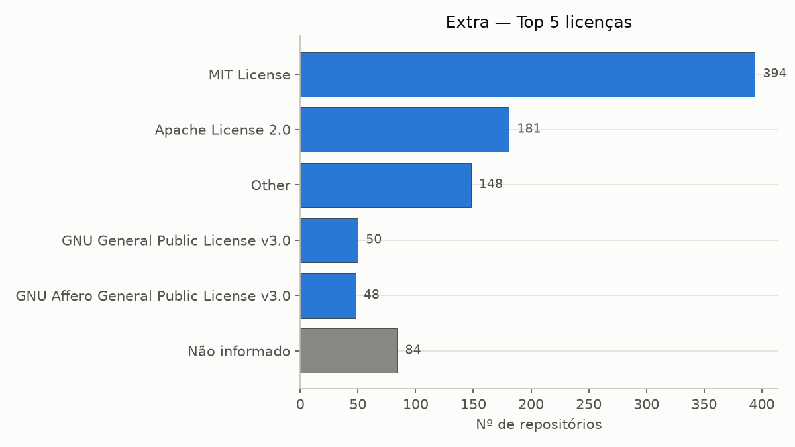
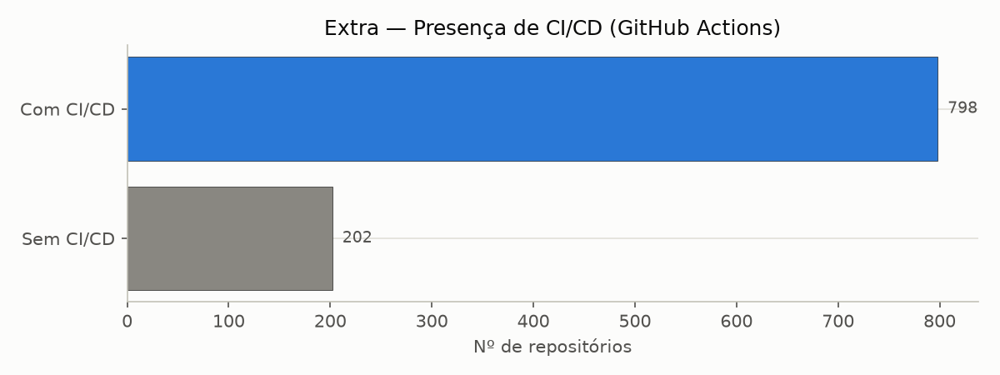
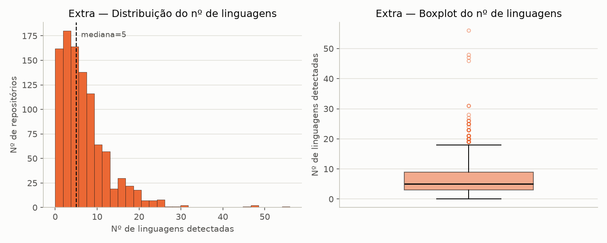

# Análise e visualização — Métricas extras (Sprint 3)

Gerado por [`analise/rq09_rq10_rq11_extras.py`](../analise/rq09_rq10_rq11_extras.py),
a partir de `data/repositories.csv` (1000 repositórios, S02). Estatística
descritiva recalculada em Python (pandas) — os valores batem exatamente com
os já reportados em `data/data-quality-report.md` (gerado em Node na S02).
As 3 métricas (licença, CI/CD, nº de linguagens) vêm da Issue #26 e
compartilham uma única
[hipótese informal na S02](hipoteses-informais.md#métricas-extras-issue-26--licença-cicd-e-diversidade-de-linguagens),
que este documento retoma métrica por métrica.

## RQ09 (extra) — Licença

| Categoria | Contagem |
|---|---|
| MIT License | 394 |
| Apache License 2.0 | 181 |
| Other | 148 |
| GNU General Public License v3.0 | 50 |
| GNU Affero General Public License v3.0 | 48 |
| *(demais 14 categorias)* | 95 |
| **Não informado** | 84 |

### Discussão — hipótese vs. resultado

A hipótese informal previa predominância de licenças permissivas sobre
copyleft. O gráfico confirma: MIT + Apache-2.0 somam 575 dos 1000
repositórios (57,5%), contra apenas 98 (9,8%) de GPLv3 + AGPLv3. A barra
"Other" (148, 14,8%) não é uma terceira categoria de peso equivalente — como
já documentado na Issue #26, a maioria desses casos é licença com expressão
SPDX não-padrão (ex.: `GPL-2.0 WITH Linux-syscall-note` do
`torvalds/linux`), não uma licença desconhecida. **Resultado: hipótese
sustentada.**

## RQ10 (extra) — Presença de CI/CD

| Com CI/CD | Sem CI/CD |
|---|---|
| 798 | 202 |

### Discussão — hipótese vs. resultado

A hipótese informal previa adoção ampla de CI/CD como sinal de maturidade de
engenharia. Quase 80% dos 1000 repositórios (798) têm pelo menos um workflow
de GitHub Actions configurado — uma maioria clara, não uma leve tendência.
**Resultado: hipótese sustentada.**

## RQ11 (extra) — Número de linguagens

| n | Mín | Q1 | Mediana | Q3 | Máx | Média |
|---|---|---|---|---|---|---|
| 1000 | 0 | 3,00 | 5,00 | 9,00 | 56 | 6,81 |

### Discussão — hipótese vs. resultado

A hipótese informal previa que a maioria dos repositórios não é
monolinguagem "pura" — o Linguist do GitHub conta build/config/docs como
linguagens à parte. O histograma confirma: pico concentrado entre 2 e 8
linguagens (mediana 5), com cauda longa até 56. O boxplot deixa visíveis
cerca de 48 outliers acima do bigode superior (~18 linguagens) — coerente
com monorepos ou projetos guarda-chuva que hospedam múltiplos subprojetos,
não erro de coleta. Média (6,81) acima da mediana (5,00) confirma a
assimetria, mas de forma bem mais moderada que em RQ08 (razão média/mediana
~1,36x aqui, contra ~1,56x em forks) — a cauda existe, mas é curta perto da
de outras métricas do dataset. **Resultado: hipótese sustentada.**
