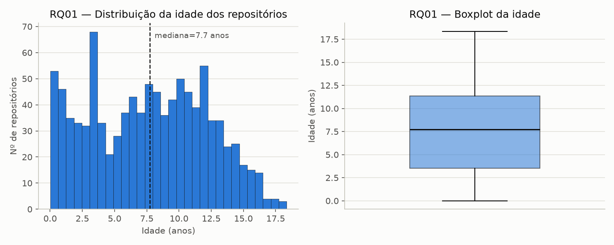
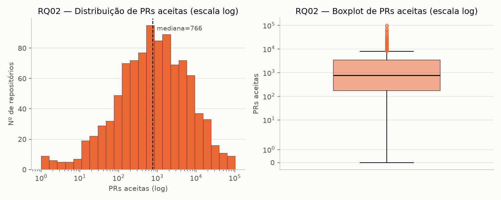

# Análise e visualização — RQ01 e RQ02 (Sprint 3)

Gerado por [`analise/rq01_rq02.py`](../analise/rq01_rq02.py), a partir de
`data/repositories.csv` (1000 repositórios, S02). Estatística descritiva
recalculada em Python (pandas) — os valores batem exatamente com os já
reportados em `data/data-quality-report.md` (gerado em Node na S02),
confirmando os números por duas implementações independentes.

## RQ01 — Idade dos repositórios

| n | Mín | Q1 | Mediana | Q3 | Máx | Média |
|---|---|---|---|---|---|---|
| 1000 | 0,01 | 3,51 | 7,72 | 11,34 | 18,35 | 7,65 |

### Discussão — hipótese vs. resultado

A [hipótese informal da S02](hipoteses-informais.md#rq01--sistemas-populares-são-madurosantigos)
previa que repositórios populares tendem a ser maduros, não recentes, mas sem
a maturidade ser um requisito rígido. O histograma confirma essa leitura de
forma visual: a distribuição é ampla e multimodal, sem um pico dominante
único, espalhando-se de forma razoavelmente uniforme entre ~2 e ~15 anos —
não existe uma "idade típica" estreita, mas sim uma faixa longa onde
repositórios populares se acumulam ao longo de quase duas décadas de
existência do GitHub. O boxplot reforça o achado da S02: mediana em 7,7 anos,
sem nenhum ponto marcado como outlier (as hastes cobrem o intervalo
inteiro, de ~0 a ~18 anos, sem valores "fora da curva"). Média (7,65) e
mediana (7,72) praticamente coincidem, o que é coerente com uma distribuição
sem outliers puxando a média para um lado. **Resultado: hipótese sustentada,
sem ajuste necessário.**

## RQ02 — Pull requests aceitas

| n | Mín | Q1 | Mediana | Q3 | Máx | Média |
|---|---|---|---|---|---|---|
| 1000 | 0 | 175 | 765,5 | 3.390 | 103.142 | 4.212,05 |

### Discussão — hipótese vs. resultado

A [hipótese informal da S02](hipoteses-informais.md#rq02--sistemas-populares-recebem-muita-contribuição-externa)
previa sustentação parcial: contribuição real e substancial no repositório
"típico", mas com uma distribuição em cauda longa puxada por um grupo pequeno
de "mega-projetos". O gráfico confirma isso com muita clareza — em escala
log, a distribuição toma a forma de um sino aproximadamente simétrico (um
padrão log-normal clássico), o que é exatamente a assinatura estatística de
"cauda longa": a maioria dos repositórios se agrupa numa faixa moderada
(algumas centenas a poucos milhares de PRs), enquanto uma minoria se estende
por múltiplas ordens de magnitude à direita. Isso fica ainda mais evidente no
boxplot: a **média (4.212) é mais de 5x a mediana (765,5)** — sinal
inequívoco de assimetria forte, coerente com os 123 outliers já detectados
na S02 (12,3% da amostra) puxando a média muito acima do valor "típico". O
boxplot em escala log também deixa visível o aglomerado denso de outliers
acima de ~10⁴ PRs — não são 1 ou 2 pontos isolados, é uma cauda inteira de
projetos de altíssima contribuição. **Resultado: hipótese sustentada — a
divisão em "repositório popular típico" (mediana ~766) vs. "mega-projetos"
(cauda de outliers) é visualmente confirmada, não apenas inferida dos
quartis.**
