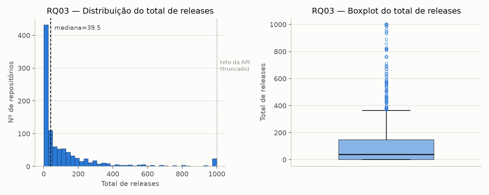
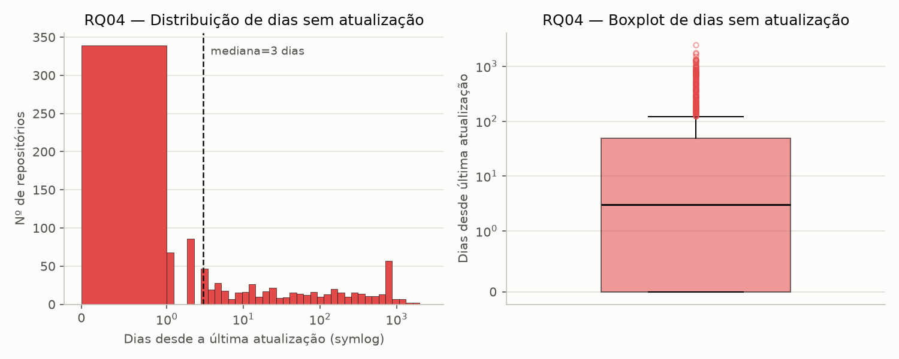

# Análise e visualização — RQ03 e RQ04 (Sprint 3)

Gerado por [`analise/rq03_rq04.py`](../analise/rq03_rq04.py), a partir de
`data/repositories.csv` (1000 repositórios, S02). Estatística descritiva
recalculada em Python (pandas) — os valores batem exatamente com os já
reportados em [`hipoteses-informais.md`](hipoteses-informais.md) (calculados
em Node na S02 a partir de `data/data-quality-report.md`), confirmando os
números por duas implementações independentes.

## RQ03 — Total de releases

| n | Mín | Q1 | Mediana | Q3 | Máx | Média |
|---|---|---|---|---|---|---|
| 1000 | 0 | 0 | 39,5 | 148,25 | 1.000 | 127,32 |

### Discussão — hipótese vs. resultado

A [hipótese informal da S02](hipoteses-informais.md#rq03--sistemas-populares-lançam-releases-com-frequência)
já apontava que "sistemas populares lançam releases com frequência" não se
sustenta como afirmação única, propondo uma leitura bimodal dependente do
tipo de repositório. O histograma confirma essa leitura visualmente: a barra
dominante concentra-se perto de zero, caindo rapidamente logo em seguida —
não existe um platô ou pico centralizado que sugira um comportamento
"típico" único de lançamento de releases. No extremo oposto, aparece uma
barra isolada exatamente em 1.000, claramente destacada do resto da
distribuição: não é um segundo modo orgânico, e sim o teto de truncamento do
campo `releases.totalCount` da API GraphQL do GitHub, já identificado na
validação da S02 (`electron/electron`, `vercel/next.js` e
`home-assistant/core` têm o valor real entre 1,6x e quase 4x maior que o
reportado). O boxplot reforça a leitura: mediana (39,5) bem abaixo da média
(127,32), com uma cauda de 94 outliers empurrando os valores para cima,
vários deles amontoados exatamente no teto de 1.000 — evidência visual direta
de que o Q3 e o máximo reportados são um piso, não o valor real, para os
projetos mais prolíficos. **Resultado: hipótese sustentada — popularidade não
implica frequência de releases; o tipo de projeto é o fator determinante, e a
métrica coletada subestima sistematicamente os casos mais extremos.**

## RQ04 — Dias desde a última atualização

| n | Mín | Q1 | Mediana | Q3 | Máx | Média |
|---|---|---|---|---|---|---|
| 1000 | 0 | 0 | 3 | 49 | 2.448 | 113,37 |

### Discussão — hipótese vs. resultado

A [hipótese informal da S02](hipoteses-informais.md#rq04--sistemas-populares-são-atualizados-com-frequência)
previa sustentação para a maioria da amostra, com uma minoria de outliers
bem explicados por projetos descontinuados. O histograma, em escala symlog,
confirma isso com clareza: a barra dominante concentra-se entre 0 e 1 dia
(339 repositórios atualizados no próprio dia da coleta), com a contagem
caindo abruptamente a partir daí e se dissipando ao longo de uma cauda longa
que se estende por mais de três ordens de magnitude, até 2.448 dias (quase
6,7 anos sem atualização). O boxplot, também em escala symlog, deixa a
assimetria ainda mais evidente: mediana de apenas 3 dias contra uma média de
113,37 — quase 38x maior —, sinal inequívoco de que uma minoria de
repositórios puxa a média muito acima do comportamento típico. Essa minoria
corresponde aos 191 outliers (19,1% da amostra) já investigados
individualmente na S02 (ex.: `atom/atom`, descontinuado pelo próprio GitHub;
`AFNetworking`, superado por API nativa da Apple) — visíveis no gráfico como
o aglomerado de círculos acima de ~100 dias no boxplot, e como o pequeno
"ombro" secundário perto de 700–800 dias no histograma. **Resultado: hipótese
sustentada — popularidade por estrelas anda junto com manutenção ativa para
a grande maioria da amostra, mas estrelas acumuladas não desaparecem quando
um projeto para, mantendo alguns "fósseis" no top 1000 muito tempo depois de
deixarem de ser mantidos.**
