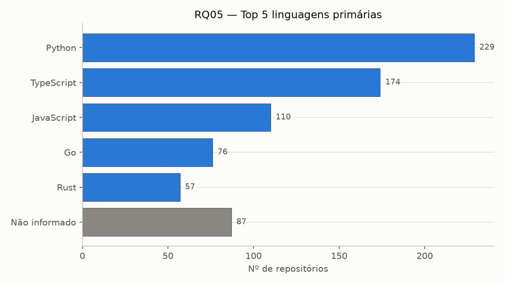
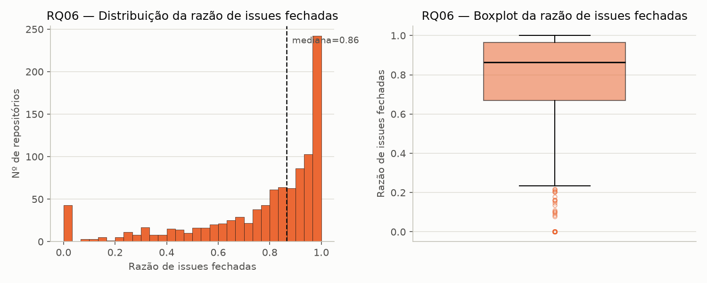
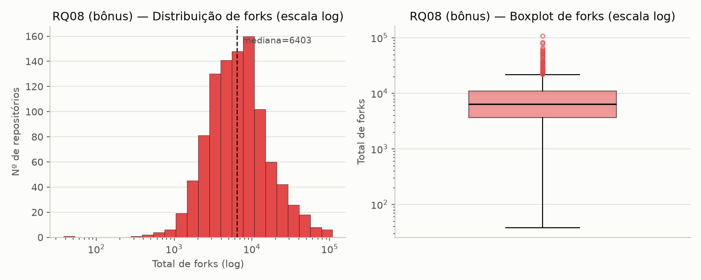
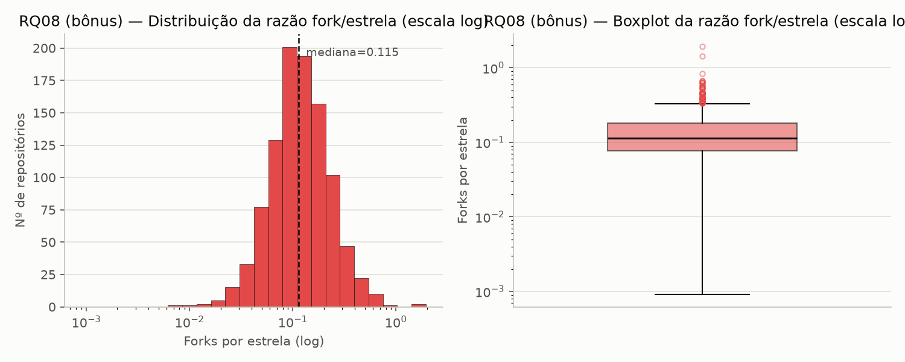

# Análise e visualização — RQ05, RQ06 e RQ08 (Sprint 3)

Gerado por [`analise/rq05_rq06_rq08.py`](../analise/rq05_rq06_rq08.py), a
partir de `data/repositories.csv` (1000 repositórios, S02). Estatística
descritiva recalculada em Python (pandas) — os valores batem exatamente com
os já reportados em `data/data-quality-report.md` (gerado em Node na S02),
confirmando os números por duas implementações independentes.

## RQ05 — Linguagem primária

| Categoria | Contagem |
|---|---|
| Python | 229 |
| TypeScript | 174 |
| JavaScript | 110 |
| Go | 76 |
| Rust | 57 |
| *(demais 38 categorias)* | 267 |
| **Não informado** | 87 |

### Discussão — hipótese vs. resultado

A [hipótese informal da S02](hipoteses-informais.md#rq05--sistemas-populares-são-escritos-nas-linguagens-mais-populares)
previa que as linguagens mais populares por estrelas coincidem com o ranking
do GitHub Octoverse. O gráfico confirma isso visualmente com folga: Python,
TypeScript e JavaScript ocupam as três primeiras posições, exatamente como
no Octoverse, e juntas somam 513 dos 1000 repositórios (51,3%) — mais da
metade da amostra concentrada em só 3 linguagens. A barra de "Não informado"
(87, cor neutra no gráfico pra não ser confundida com uma linguagem
ranqueada) aparece deliberadamente fora da ordenação por valor, mesmo tendo
mais casos que Go e Rust — ela não compete no ranking de linguagens porque
não representa uma linguagem, e sim a ausência de uma linguagem dominante
detectável (majoritariamente listas/coleções, como já documentado na S02).
**Resultado: hipótese sustentada.**

## RQ06 — Razão de issues fechadas

| n | Mín | Q1 | Mediana | Q3 | Máx | Média |
|---|---|---|---|---|---|---|
| 1000 | 0,00 | 0,67 | 0,86 | 0,97 | 1,00 | 0,77 |

### Discussão — hipótese vs. resultado

A [hipótese informal da S02](hipoteses-informais.md#rq06--sistemas-populares-possuem-um-alto-percentual-de-issues-fechadas)
previa sustentação com folga — mediana alta (86%), mas com dois grupos de
outlier em direções opostas. O histograma confirma isso de forma bem visual:
a distribuição é fortemente concentrada perto de 1,0 (o último intervalo do
histograma, entre ~0,95 e 1,0, sozinho reúne mais de 230 repositórios — quase
um quarto da amostra), com uma cauda que se estende gradualmente até valores
baixos. Só que também aparece um pico isolado bem em 0,0 (43 repositórios,
visível como uma barra separada, sem conexão com o resto da distribuição) —
esse é justamente o grupo dos 60 outliers já detectados na S02, e o
histograma deixa claro que ele **não é uma cauda contínua**: é um cluster
distinto na origem, coerente com repositórios que não usam o rastreador de
Issues do GitHub (caso do `torvalds/linux`, já documentado). O boxplot
reforça a leitura: caixa estreita entre 0,67 e 0,97, mediana em 0,86 bem
deslocada pro topo da caixa, e uma fileira de outliers marcados abaixo de
~0,22 — exatamente o grupo problemático que a mediana isolada não deixava
visível. **Resultado: hipótese sustentada, com o cluster de zeros confirmado
como um padrão distinto, não ruído aleatório.**

## RQ08 (bônus) — Total de forks e razão fork/estrela

| n | Mín | Q1 | Mediana | Q3 | Máx | Média |
|---|---|---|---|---|---|---|
| 1000 | 38 | 3.624,5 | 6.403 | 10.915,5 | 108.902 | 9.980,71 |

Com `stargazerCount` agora coletado (Issue #54), dá pra testar a métrica que
a hipótese original da Issue #4 sempre pediu:

| n | Mín | Q1 | Mediana | Q3 | Máx | Média |
|---|---|---|---|---|---|---|
| 1000 | 0,0009 | 0,0770 | 0,1146 | 0,1797 | 1,9474 | 0,1459 |

### Discussão — hipótese vs. resultado

O histograma de `total_forks` em escala log mostra uma forma aproximadamente
log-normal, o mesmo padrão já visto em RQ02 (PRs aceitas), sugerindo que
forks seguem a mesma dinâmica de cauda longa de outras métricas de
engajamento open-source. Média (9.980,71) acima da mediana (6.403) confirma
a assimetria, embora menos extrema que em RQ02 (razão média/mediana aqui
~1,56x, contra mais de 5x em RQ02).

O histograma da razão fork/estrela conta uma história diferente da magnitude
absoluta. A distribuição também é de cauda longa em escala log, mas a faixa
é enorme: de 0,0009 a 1,9474, uma variação de mais de 2.100x — proporcionalmente
muito mais larga que a de forks ou estrelas isoladas. Investigando os
extremos: no topo, `firstcontributions/first-contributions` (razão 1,95) e
`eugenp/tutorials` (razão 1,43) são repositórios de tutorial/prática feitos
para serem forkados — o fork é o uso pretendido, não um efeito colateral da
popularidade. No fundo, `hexojs/hexo` (razão 0,0009) é consumido via
`npm install`, raramente clonado para modificação. O boxplot deixa visível
uma quantidade grande de outliers acima do bigode superior — mas, ao
contrário de RQ02/RQ08 (forks absolutos), aqui os outliers concentram um
*tipo* de repositório, não só um tamanho.

**Resultado: hipótese sustentada parcialmente.** A mediana de 0,11 (~1 fork
a cada 9 estrelas) indica engajamento ativo real, não só popularidade
passiva — dar estrela custa um clique, fazer fork exige intenção. Mas "alta
razão fork/estrela" não é uma propriedade uniforme de sistemas populares: ela
depende do tipo de projeto (tutorial/template vs. ferramenta/biblioteca
consumida como dependência), não da popularidade em si.
