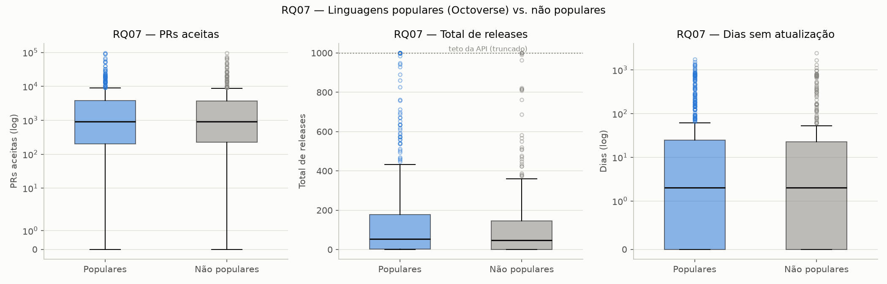

# Análise — RQ07: contribuição, releases e atualização por linguagem (Sprint 3)

Gerado por [`analise/rq07_linguagens.py`](../analise/rq07_linguagens.py), a
partir de `data/repositories.csv` (1000 repositórios, S02).

**RQ07:** sistemas escritos nas linguagens mais populares recebem mais
contribuição externa, lançam mais releases e são atualizados com mais
frequência?

## Fonte de "linguagens populares"

Mesma fonte usada desde a Issue #3 (RQ05): **GitHub Octoverse**. Consultei a
edição mais recente (Octoverse 2025,
[github.blog](https://github.blog/news-insights/octoverse/octoverse-a-new-developer-joins-github-every-second-as-ai-leads-typescript-to-1/))
pro top 5 atual por contribuidores — **TypeScript, Python, JavaScript, Java,
C#**. Não uso o top 5 do nosso próprio dataset (RQ05, seção de "Análise e
visualização" da S03), porque isso seria circular: usar as linguagens mais
comuns *dentro da nossa amostra de repositórios populares* pra definir
"popular" garantiria a conclusão antes mesmo de medir qualquer coisa.

Classificação nos 1000 repositórios (excluindo os 87 "Não informado", que
não representam uma linguagem):

| Grupo | n |
|---|---:|
| Populares (TypeScript, Python, JavaScript, Java, C#) | 562 |
| Não populares (linguagem real, fora do top 5) | 351 |

## Comparação

| Métrica | Mediana — Populares | Mediana — Não populares | Kruskal-Wallis (H) | p-valor |
|---|---:|---:|---:|---:|
| PRs aceitas (RQ02) | 927 | 915 | 0,06 | 0,810 |
| Total de releases (RQ03) | 54 | 48 | 1,31 | 0,253 |
| Dias sem atualização (RQ04) | 2 | 2 | 0,19 | 0,666 |

*(RQ03 sujeito ao mesmo teto de 1.000 releases da API GraphQL já documentado
em `analise/rq03_rq04.py` — não afeta a leitura da mediana, que fica bem
abaixo do teto nos dois grupos.)*

## Conclusão sobre a hipótese

**A hipótese não se sustenta nesta amostra.** As três comparações — PRs
aceitas, releases e dias sem atualização — deram Kruskal-Wallis não
significativo (p > 0,25 em todos os casos, bem acima do limiar convencional
de 0,05), e as medianas entre os dois grupos são praticamente idênticas
(diferença de 1,3% em PRs, 12% em releases, 0 dias em atualização). O
boxplot reforça isso visualmente: as caixas de "Populares" e "Não populares"
têm formato e posição quase indistinguíveis nos três painéis.

A leitura mais provável não é que popularidade de linguagem seja irrelevante
em geral, mas que **o efeito desaparece dentro deste recorte específico**: a
amostra já é o top 1000 repositórios por estrelas do GitHub inteiro — um
grupo extremamente seleto, onde só entram projetos que já romperam uma
barreira alta de visibilidade e engajamento, independente da linguagem. É
plausível que a popularidade da linguagem influencie *quem consegue chegar*
a esse patamar (mais desenvolvedores numa linguagem popular → mais chance de
algum projeto viralizar), mas, uma vez lá dentro, o comportamento de
contribuição/manutenção passa a depender mais de outros fatores (tipo de
projeto, maturidade, governança) do que da linguagem em si. Testar essa
hipótese alternativa exigiria comparar contra uma amostra mais ampla de
repositórios (não só o top 1000), fora do escopo deste laboratório.
