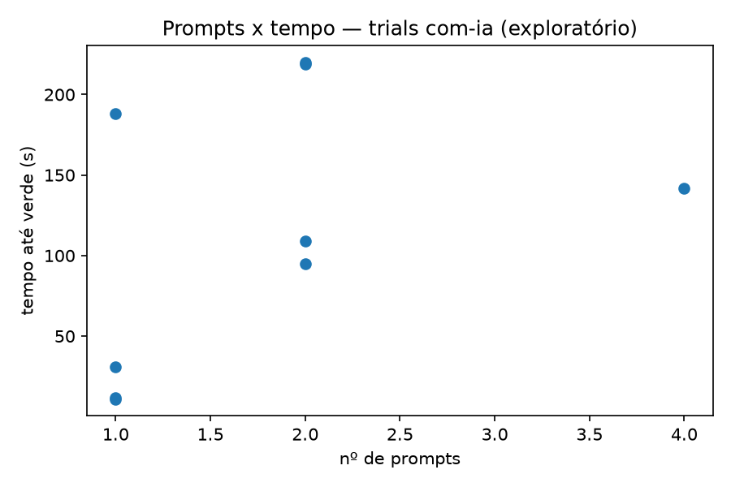
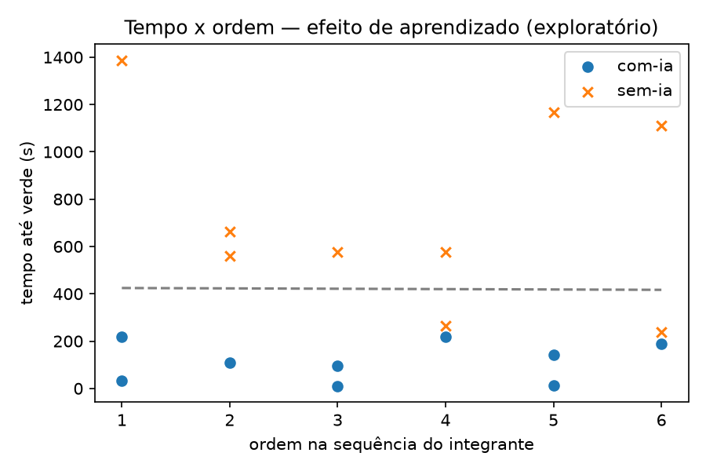

# Lab02 — Análise RQ1 e RQ2 (Passo 4)

Gerado por [`analise/rq1_rq2_estatistica.py`](../analise/rq1_rq2_estatistica.py),
a partir de `dados/trials.csv` + `dados/contagem-testes.csv` (18 trials, S02).
Hipóteses e teste previsto em [`docs/02-hipoteses.md`](../docs/02-hipoteses.md)
(#65); ameaças mitigadas aqui em [`docs/03-ameacas-validade.md`](../docs/03-ameacas-validade.md)
(#66) — efeito de aprendizado (#1) e proporção de censura (#5).

## Esquema de pareamento usado

`02-hipoteses.md` define o par como "o mesmo integrante sob os dois
tratamentos", mas cada integrante tem 3 trials por tratamento, não 1. Uso a
**mediana por integrante por tratamento** como o par formal do Wilcoxon
(N=3 pares — Brenda, Carlos, Gabriela). Para o **bootstrap**, reamostro no
nível de trial (9 `com-ia` vs. 9 `sem-ia`, pooled entre os três) em vez dos
3 pares agregados — troca "estritamente pareado" por mais resolução de
reamostragem, deliberadamente, porque N=3 sozinho dá poucos padrões
possíveis de reamostrar.

## RQ1 — Tempo até verde

| Tratamento | Mediana | IQR |
|---|---:|---:|
| com-ia | 109,0 s | [31,0 ; 188,0] |
| sem-ia | 576,0 s | [561,0 ; 1112,0] |

- **Outlier (IQR global):** 1387 s — o trial `carlos/k3-sem-ia`, já
  documentado como um trial real (não erro de coleta) que teve o tempo
  corrigido a partir do log do terminal após um Ctrl+C acidental pós-verde.
- **Wilcoxon pareado (N=3, unicaudal, H1: com-ia < sem-ia):** W=0,00,
  **p=0,1250**, r=-1,000 (correlação rank-biserial, efeito máximo possível).
- **Bootstrap IC 95% da diferença de mediana (com-ia − sem-ia):**
  **[-1071,0 ; -171,0]** — todo o intervalo é negativo, ou seja, a
  reamostragem nunca produziu um cenário em que `sem-ia` fosse mais rápido.
- **Proporção de censura:** 0% nos dois tratamentos (nenhum trial estourou
  o time-box de 35 min).

### Achado central de RQ1 — significância vs. tamanho de efeito

Com N=3, **W=0 é o resultado mais extremo matematicamente possível** —
mesmo assim, o p-valor unicaudal (0,125) fica acima do limiar convencional
de α=0,05. **Não existe nenhum resultado que este desenho pudesse produzir
capaz de rejeitar H0 com significância convencional**, por mais que o efeito
seja grande na prática. Isso não significa que a IA não ajudou: a mediana de
109s contra 576s é uma diferença de mais de 5x, e o bootstrap (que usa os 18
trials, não só os 3 pares) devolve um intervalo inteiramente negativo,
reforçando que o efeito é real e consistente — só não é **estatisticamente
detectável** no teste formal, dado o N pequeno (ameaça de conclusão #4 da
`#66`, confirmada na prática, não só citada em teoria).

## RQ2 — Defeitos

| Tratamento | Mediana | IQR |
|---|---:|---:|
| com-ia | 100,0% | [100,0 ; 100,0] |
| sem-ia | 100,0% | [100,0 ; 100,0] |

- **Wilcoxon:** não computável — **as 18 linhas de `contagem-testes.csv`
  têm `taxa_sucesso = 100,0` e `testes_falhando = 0`, sem exceção**, nos
  dois tratamentos. Diferença pareada é zero em todos os 3 integrantes.
- **Densidade de defeitos (testes_falhando/KLOC):** máximo observado =
  0,000 (métrica complementar/opcional do enunciado — zero em toda a
  amostra, pela mesma razão acima).

### Achado central de RQ2 — sem variância na amostra

H0 não pode ser rejeitada nem confirmada por falta de variação — **não é
um resultado nulo, é ausência de dado pra testar**. Todos os três
integrantes terminaram todos os 18 trials com 100% dos testes de aceitação
passando, com ou sem IA. A leitura mais provável: o time-box de 35 minutos
para katas desse porte (10-11 casos de teste, dificuldade calibrada em
`katas.md`) deu tempo suficiente pra qualquer um dos três integrantes
chegar numa solução correta, independente do tratamento — RQ2, como
desenhada, não teve espaço para diferenciar `com-ia` de `sem-ia` nesta
amostra.

## Gráficos exploratórios

Os gráficos "oficiais" do dashboard completo (boxplots pareados, bubble
chart, heatmap) ficam na Issue #123 — os dois acima são exploratórios,
específicos do que esta issue pediu.
