# Lab02 — Assistentes de IA vs. codificação manual

**Integrantes:** Brenda Evers (1523565), Carlos José Gomes Batista
Figueiredo (1507022), Gabriela Alvarenga Cardoso (1026227)

**Repositório:** <https://github.com/gabialvarenga/lab-experimentacao-software>
(pasta `lab02/`)
**GitHub Projects (Kanban):** <https://github.com/users/gabialvarenga/projects/9/views/1>

---

## 1. Introdução

Este experimento avalia o efeito do uso de um assistente de IA generativa na
resolução de tarefas de programação. O desenho é um crossover
*within-subject*, contrabalanceado e com tempo limitado (*time-boxed*):
cada integrante resolve seis katas, três com IA e três sem, de modo que a
comparação central é sempre a mesma pessoa consigo mesma.

**Objetivo (GQM).** Analisar o uso de um assistente de IA generativa na
resolução de tarefas de programação, com o propósito de comparar seu efeito
frente à codificação manual, com respeito a tempo de resolução, qualidade
funcional (defeitos) e qualidade estrutural do código, do ponto de vista do
grupo pesquisador, no contexto de katas de dificuldade equivalente
resolvidas por estudantes de graduação sob condições controladas
(crossover *within-subject*, com tempo limitado).

### 1.1 Questões de pesquisa e hipóteses

Nível de significância α = 0,05 nos três testes. Teste: Wilcoxon signed-rank
pareado (não paramétrico, adequado ao N pequeno). Detalhes em
[`docs/02-hipoteses.md`](../docs/02-hipoteses.md).

| RQ | Variável | H0 | H1 | Teste |
|---|---|---|---|---|
| RQ1 — Tempo | `tempo_segundos` | a mediana do tempo até verde é igual com e sem IA | a mediana é **menor** com IA | Wilcoxon pareado, unicaudal |
| RQ2 — Defeitos | `taxa_sucesso` (complementar: testes falhando) | a mediana da taxa de sucesso é igual com e sem IA | a mediana é **maior** com IA | Wilcoxon pareado, unicaudal |
| RQ3 — Estrutura do código | `cc_media` e `duplicacao_pct` (controle: `loc`) | a mediana é igual com e sem IA | a mediana **difere** entre os tratamentos (sem direção a priori) | Wilcoxon pareado, bicaudal, um teste por variável |

Fórmulas, por RQ:
- RQ1: H0: `Med(tempo | com-ia) = Med(tempo | sem-ia)`; H1: `Med(tempo | com-ia) < Med(tempo | sem-ia)`.
- RQ2: H0: `Med(taxa_sucesso | com-ia) = Med(taxa_sucesso | sem-ia)`; H1: `Med(taxa_sucesso | com-ia) > Med(taxa_sucesso | sem-ia)`.
- RQ3: H0: `Med(cc_media | com-ia) = Med(cc_media | sem-ia)` e o análogo para `duplicacao_pct`; H1: as medianas diferem.

O Índice de Manutenibilidade (`mi`) entra como aprofundamento da RQ3, sem
hipótese formal própria.

---

## 2. Metodologia

### 2.1 Desenho experimental

- **Variável independente:** uso do assistente de IA (`com-ia` / `sem-ia`).
- **Tipo:** crossover *within-subject*, contrabalanceado. Cada integrante
  faz 3 trials em cada tratamento.
- **Total:** 3 integrantes × 6 katas = **18 trials**, 9 com IA e 9 sem IA.
- **Tempo por trial:** 35 minutos. Trial que estoura o tempo entra como
  censurado (2100 s), sem ser descartado. Nenhum dos 18 trials foi
  censurado.
- **Contrabalanceamento:** nenhum kata é sempre `com-ia` ou sempre `sem-ia`,
  e o tratamento alterna a cada posição da sequência de cada integrante.

| ordem | Brenda | Carlos | Gabriela |
|---|---|---|---|
| 1 | k1 · com-ia | k3 · sem-ia | k4 · com-ia |
| 2 | k2 · sem-ia | k2 · com-ia | k3 · sem-ia |
| 3 | k3 · com-ia | k1 · sem-ia | k1 · com-ia |
| 4 | k4 · sem-ia | k4 · com-ia | k2 · sem-ia |
| 5 | k5 · com-ia | k6 · sem-ia | k6 · com-ia |
| 6 | k6 · sem-ia | k5 · com-ia | k5 · sem-ia |

Desenho completo em [`docs/01-desenho-experimento.md`](../docs/01-desenho-experimento.md).

### 2.2 Katas

Seis katas autorais em Python, de dificuldade comparável, cada uma com
suíte de testes de aceitação em `pytest` (10 ou 11 casos). Foram escritas
pelo grupo, com domínios inventados, para reduzir o risco de o assistente
reproduzir uma solução memorizada.

| kata | função | casos de teste |
|---|---|---:|
| k1 | `consumo_bateria` | 10 |
| k2 | `validar_lote` | 11 |
| k3 | `montar_escala` | 10 |
| k4 | `calcular_tarifa` | 11 |
| k5 | `mesclar_leituras` | 10 |
| k6 | `ranking_trilhas` | 10 |

Critérios de equivalência de dificuldade e candidatos descartados em
[`docs/katas.md`](../docs/katas.md).

### 2.3 Tratamentos

- **`com-ia`:** Claude Code com acesso ao diretório do kata, podendo editar
  `solucao.py` e rodar os testes por conta própria, sem limite de iterações
  além dos 35 minutos.
- **`sem-ia`:** Claude Code fechado e autocompletar por IA da IDE desligado.
  Documentação oficial e busca convencional continuam permitidas.

### 2.4 Assistente de IA

Claude Code (assinatura paga), modelo Claude Sonnet 5, o mesmo para os três
integrantes em todos os trials `com-ia`.

- Versão do Claude Code: Gabriela 2.1.233; Carlos 2.7032.0.0; Brenda 2.1.282.
- Nível de esforço do modelo: Medium (padrão) para os três integrantes.

### 2.5 Ambiente

| Integrante | SO | IDE | Python | Node |
|---|---|---|---|---|
| Brenda | Windows 11 Home Single Language | VS Code | 3.14.3 | 24.14.0 |
| Carlos | Windows 11 Home (10.0.26200) | VS Code | 3.12.10 | 24.19.0 |
| Gabriela | Windows 11 Home (build 26200) | VS Code | 3.14.3 | 24.14.0 |

Ferramentas de métricas, com a mesma configuração para todos os trials:
radon 6.0.1 (complexidade ciclomática, LOC e índice de manutenibilidade) e
jscpd 5.2.0 (duplicação). Testes de aceitação com `pytest`
(`--junitxml`). Análise em pandas, numpy e scipy (`lab02/requirements.txt`).

### 2.6 Métricas por RQ e coleta

Métrica escolhida em cada RQ, entre as candidatas do enunciado, e a
justificativa:

| RQ | Métrica | Justificativa |
|---|---|---|
| RQ1 | tempo até passar em todos os testes de aceitação (mediana); nº de prompts como exploratória | métrica primária recomendada; mediana por causa do N pequeno e da sensibilidade da média a outliers |
| RQ2 | taxa de sucesso dos testes (%); testes falhando e densidade de defeitos como complementares | a taxa normaliza katas com número diferente de testes; o total de testes é o do kata original, para que um trial que não compilou não apareça com denominador menor |
| RQ3 | complexidade ciclomática média (Radon `cc`) e duplicação (jscpd), com `loc` como controle; Índice de Manutenibilidade (Radon `mi`) como aprofundamento | `loc` controla a hipótese de que o código de IA seja apenas mais verboso; o MI é composto por complexidade, LOC e volume de Halstead |

Coleta feita por `scripts/cronometro.py` (tempo), `scripts/contagem_testes.py`
(testes) e `scripts/metricas_estaticas.py` (métricas estáticas).

Três arquivos em `lab02/dados/`, ligados por `integrante` + `kata` +
`tratamento`:

- `trials.csv` — tempo até verde, censura, testes totais e passando,
  nº de prompts, ordem do trial.
- `metricas-estaticas.csv` — `loc`, `cc_media`, `cc_max`, `mi`,
  `duplicacao_pct`, medidos sobre o código final de cada trial.
- `contagem-testes.csv` — taxa de sucesso e testes falhando por trial.

### 2.7 Análise estatística

- **Descritiva:** mediana e IQR por tratamento (não média/desvio-padrão, por
  causa do N pequeno).
- **Inferencial:** Wilcoxon signed-rank pareado. Como cada integrante tem 3
  trials por tratamento, o par formal é a **mediana por integrante por
  tratamento** (N = 3 pares). Tamanho de efeito: correlação rank-biserial.
- **Bootstrap:** IC 95% da diferença de mediana (10.000 reamostragens,
  semente 42), reamostrando no nível de trial (9 vs. 9), para dar mais
  resolução que os 3 pares.
- **Reprodução:** um único comando refaz os CSVs derivados de `trials/`, as
  estatísticas de RQ1 a RQ3 e os gráficos (`--pular-metricas` se não houver
  Node.js instalado; detalhes em [`../scripts/README.md`](../scripts/README.md)).

```bash
python -m pip install -r lab02/requirements.txt
python lab02/scripts/rodar_analise_completa.py
```

A saída completa das estatísticas fica versionada em
[`resultados-estatisticos.txt`](resultados-estatisticos.txt). Análises
escritas por RQ: [`analise-rq1-rq2.md`](analise-rq1-rq2.md) e
[`analise-rq3.md`](analise-rq3.md).

---

## 3. Resultados

### 3.1 RQ1 — Tempo até verde

| Tratamento | Mediana | IQR |
|---|---:|---|
| com-ia | 109,0 s | [31,0 ; 188,0] |
| sem-ia | 576,0 s | [561,0 ; 1112,0] |

Par por integrante (mediana dos 3 trials):

| Integrante | com-ia | sem-ia |
|---|---:|---:|
| Brenda | 142 s | 266 s |
| Carlos | 188 s | 1166 s |
| Gabriela | 12 s | 576 s |

- **Wilcoxon pareado (N = 3, unicaudal):** W = 0,00, **p = 0,1250**,
  r = −1,000.
- **Bootstrap IC 95% da diferença de mediana (com-ia − sem-ia):**
  **[−1071,0 ; −171,0]**.
- **Censura:** 0% nos dois tratamentos.
- **Outlier:** 1387 s (`carlos/k3`, sem-ia), trial real com tempo corrigido
  a partir do log do terminal.

**Achado:** o efeito é grande (mediana ~5× menor) e consistente nos três
integrantes, mas **o teste formal não rejeita H0**. Com N = 3, W = 0 é o
resultado mais extremo possível e mesmo assim dá p = 0,125 > 0,05: nenhum
resultado deste desenho poderia ser significativo. O bootstrap, que usa os
18 trials, dá um intervalo inteiramente negativo.

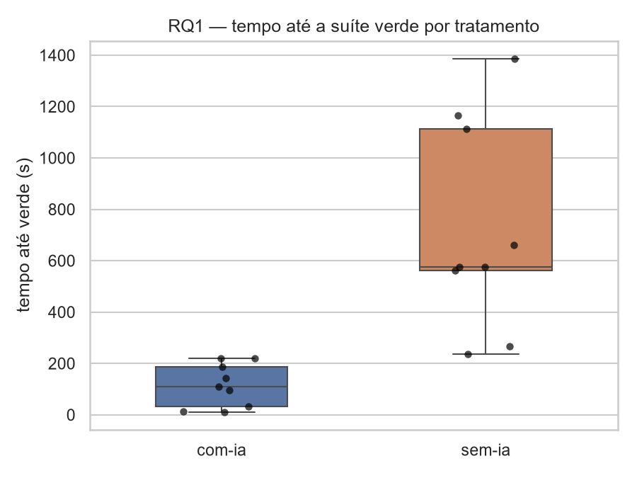

**Prompts × tempo (trials `com-ia`, exploratório):**

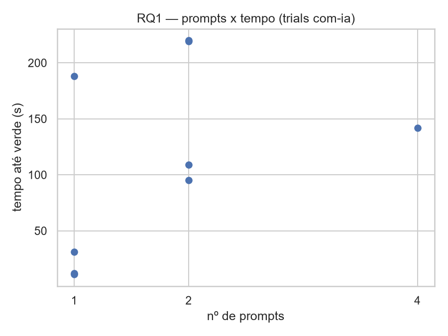

Os trials `com-ia` usaram de 1 a 4 prompts (mediana 2). Spearman entre
prompts e tempo: 0,56.

**Efeito de aprendizado (tempo × ordem):**

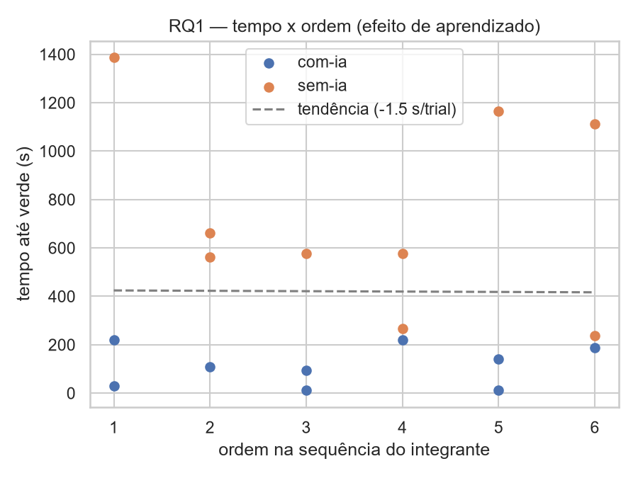

Spearman entre a ordem do trial e o tempo, nos 18 trials: 0,03 (com-ia: 0,03;
sem-ia: −0,27). Não há tendência clara de os trials ficarem mais rápidos ao
longo da sequência, coerente com o contrabalanceamento de ordem, embora
com N tão pequeno isso não descarte um efeito de aprendizado.

### 3.2 RQ2 — Defeitos

| Tratamento | Mediana da taxa de sucesso | IQR |
|---|---:|---|
| com-ia | 100,0% | [100,0 ; 100,0] |
| sem-ia | 100,0% | [100,0 ; 100,0] |

- **Wilcoxon:** não computável. Os 18 trials terminaram com 100% dos testes
  passando (`testes_falhando = 0`), então a diferença pareada é zero em todos
  os integrantes.
- **Densidade de defeitos** (testes falhando / KLOC): máximo observado 0,000.

**Achado:** não é um resultado nulo, é ausência de variação para testar. H0
não pode ser rejeitada nem confirmada. Provável causa: o time-box de 35 min
foi folgado para katas deste porte, e qualquer integrante chegou a uma
solução correta, com ou sem IA. RQ2, como desenhada, não discrimina os
tratamentos nesta amostra.

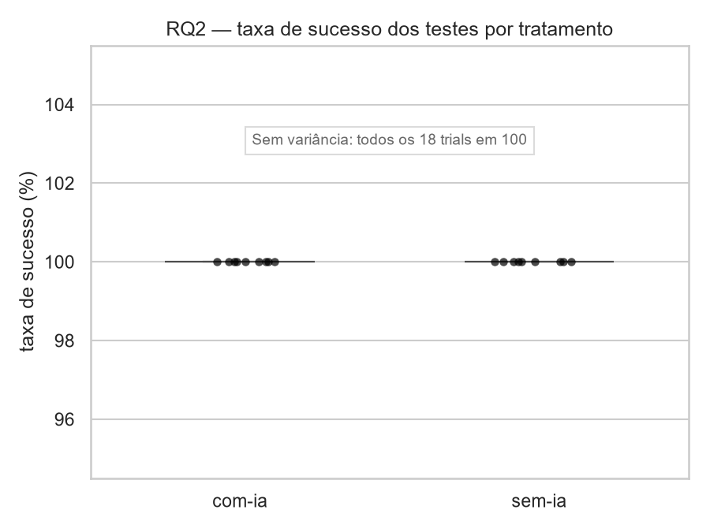

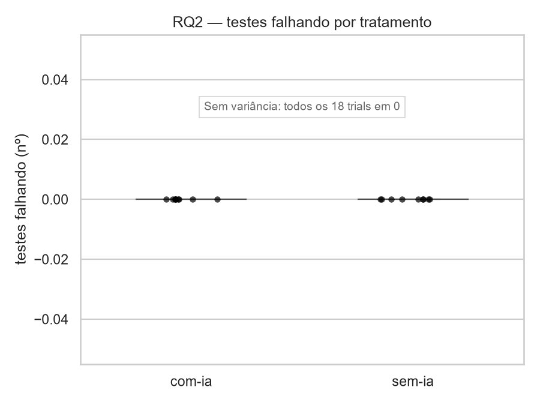

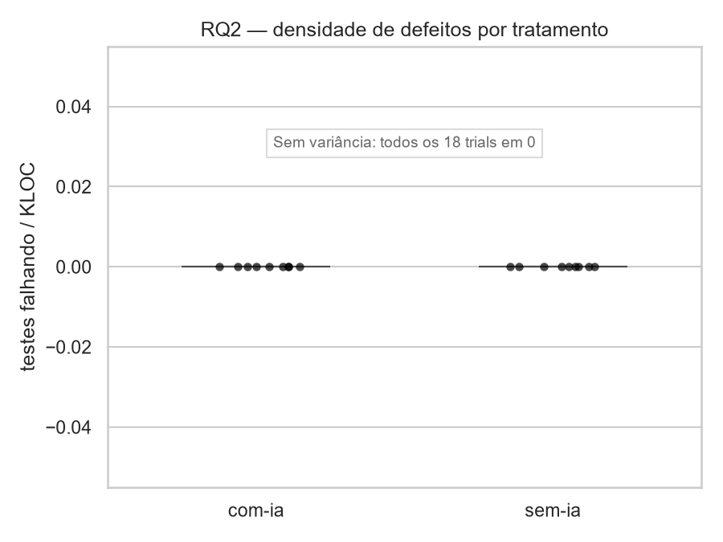

Os três gráficos saem achatados porque todos os trials tiveram 100% de
sucesso e 0 testes falhando (efeito teto).

### 3.3 RQ3 — Estrutura do código

| Métrica | com-ia | sem-ia |
|---|---:|---:|
| `cc_media` | 4,00 [3,50 ; 6,00] | 6,00 [6,00 ; 7,00] |
| `duplicacao_pct` | 0,00 [0,00 ; 0,00] | 0,00 [0,00 ; 0,00] |
| `loc` (controle) | 18,0 [18,0 ; 20,0] | 20,0 [18,0 ; 23,0] |
| `mi` (aprofundamento) | 60,62 [59,81 ; 61,53] | 60,13 [55,05 ; 64,39] |

- **`cc_media`:** Wilcoxon bicaudal W = 0,00, **p = 0,5000**, r = −1,000;
  bootstrap IC 95% **[−5,00 ; 0,00]**. Carlos empatou (6,00 nos dois), então
  o teste roda com 2 pares efetivos e nenhum resultado possível seria
  significativo. A direção favorece `com-ia`, sem evidência estatística.
- **`duplicacao_pct`:** Wilcoxon não computável (mediana 0% em todos os
  pares). Só 1 dos 18 trials teve duplicação (`gabriela/k5`, sem-ia,
  35,71%).
- **`loc` (controle):** `com-ia` não é mais verboso (mediana 18 contra 20;
  IC 95% da diferença [−5,00 ; +1,00]). Os extremos de `loc` aparecem em
  `com-ia` (11 e 26 linhas, este último de `carlos/k4`), o que aumenta a
  dispersão, mas não desloca a mediana. Spearman entre `loc` e `cc_media`
  nos 18 trials: −0,10, então a menor complexidade não parece ser efeito de
  tamanho.
- **Outliers (regra do IQR global):** `duplicacao_pct` = 35,71; `loc` = 11,
  25 e 26; `mi` = 73,82 e 75,25. São valores reais, mantidos na análise.
- **`mi`:** medianas quase iguais, Wilcoxon p = 1,0000, r = 0,000, IC 95%
  [−12,63 ; +6,48]. Sem efeito direcional; a dispersão é menor em `com-ia`
  (IQR 1,72 contra 9,34), como observação e não como achado. Pela fórmula
  do MI, volume e LOC pesam mais que a complexidade ciclomática, o que
  explica o MI não acompanhar a queda de `cc_media`.

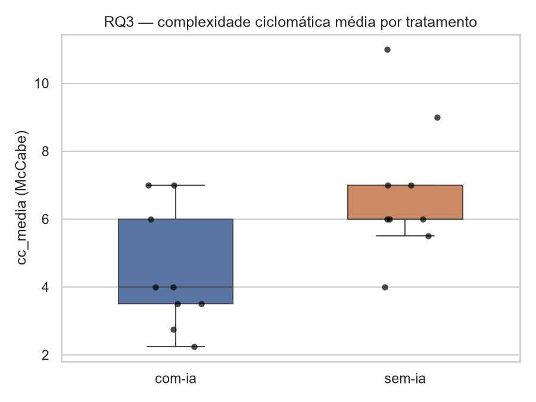

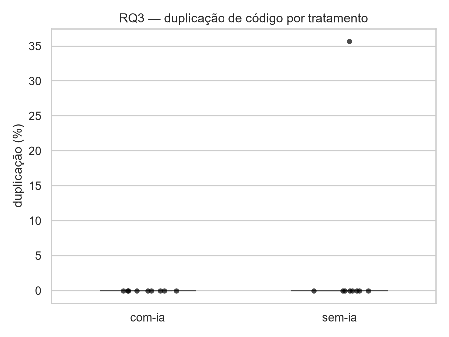

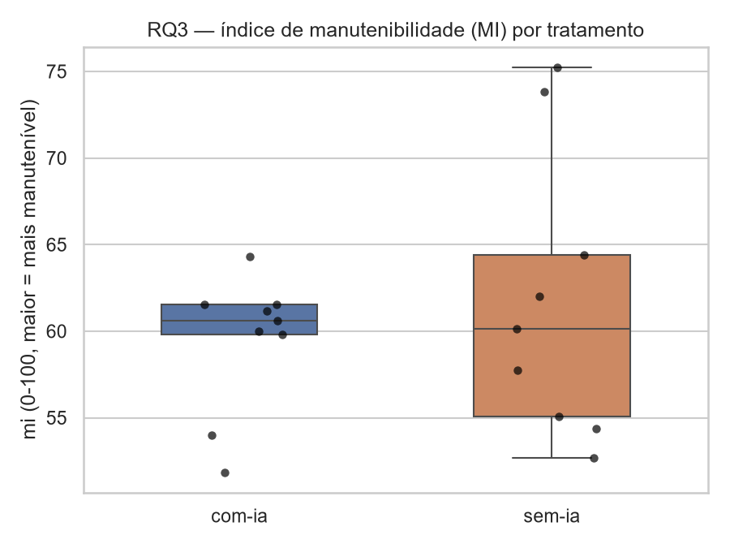

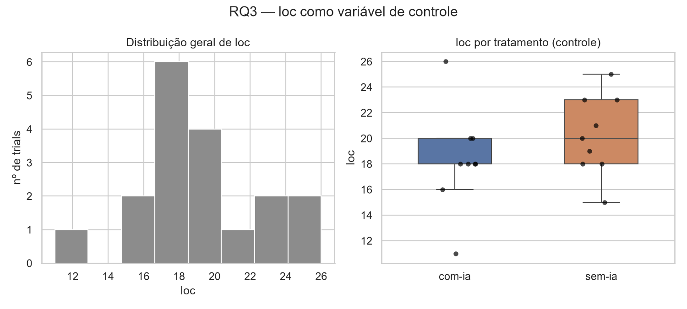

### 3.4 Análises complementares

**Trade-off velocidade × qualidade** (tempo × `cc_media`, tamanho da bolha =
`loc`, cor = tratamento):

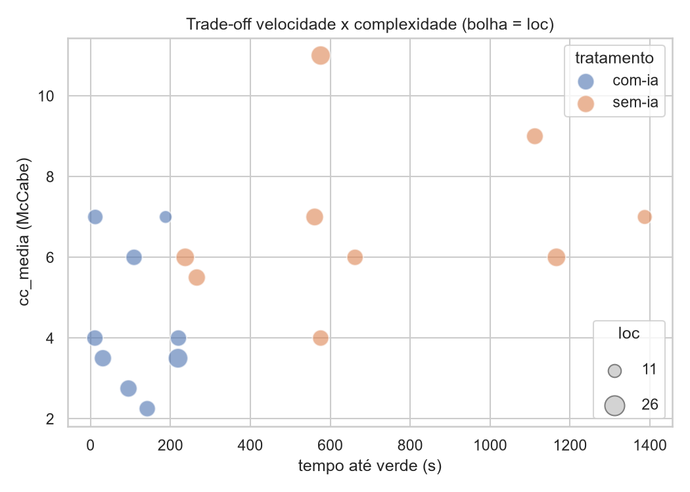

**Correlação entre métricas estruturais** (Spearman, 18 trials):

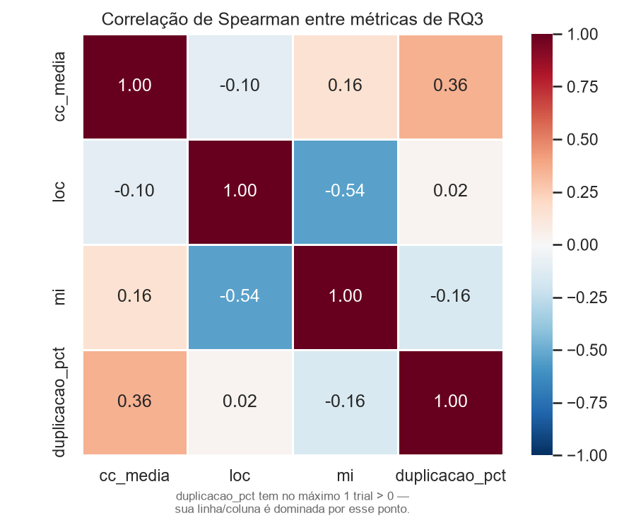

`loc` × `cc_media` = −0,10 e `loc` × `mi` = −0,54; `cc_media` ×
`duplicacao_pct` = 0,36 (dominado por um único trial com duplicação).

**Efeito por kata** (barras agrupadas kata × tratamento):

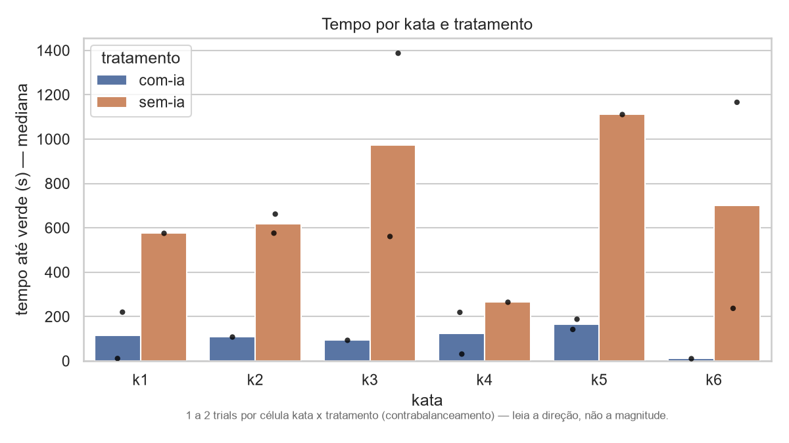

A mediana do tempo é menor com IA nas seis katas. Cada célula kata ×
tratamento tem só 1 ou 2 trials, então o gráfico mostra a direção do
efeito, não sua magnitude.

---

## 4. Discussão

**Síntese por RQ.**

| RQ | Resultado | Decisão sobre H0 (α = 0,05) | Leitura |
|---|---|---|---|
| RQ1 — Tempo | p = 0,125; r = −1,00; IC [−1071 ; −171] s | não rejeitada | efeito grande e consistente com IA, sem significância possível com N = 3 |
| RQ2 — Defeitos | não computável | indeterminada | sem variação: todos os trials com 100% |
| RQ3 — `cc_media` | p = 0,50; IC [−5,0 ; 0,0] | não rejeitada | complexidade menor com IA na direção, sem evidência estatística |
| RQ3 — `duplicacao_pct` | não computável | indeterminada | 17 de 18 trials com 0% |
| RQ3 — `mi` (exploratório) | p = 1,00 | sem hipótese formal | sem efeito direcional |

**O que o experimento consegue dizer.** Com IA, os integrantes chegaram à
solução correta mais rápido em todos os três pares, sem que o código ficasse
mais longo (`loc`) e, na direção, com complexidade ciclomática menor. Não
houve diferença detectável em correção (teto de 100% nos dois tratamentos),
duplicação nem manutenibilidade.

**Por que quase nenhum teste é significativo.** Não é falta de efeito, é
limite do desenho: com 3 pares, o menor p possível do Wilcoxon é 0,125
(unicaudal) ou 0,25 (bicaudal), e cai para 0,5 quando um par empata. Isso
confirma na prática a ameaça de conclusão #4 de
[`docs/03-ameacas-validade.md`](../docs/03-ameacas-validade.md). O bootstrap
no nível de trial ajuda a ver o tamanho do efeito, mas não substitui o teste
pareado, e trata como independentes trials do mesmo integrante.

**Teto em RQ2 e duplicação.** Katas de 10 a 11 casos e 11 a 26 linhas, com
35 minutos disponíveis, foram fáceis demais para produzir falhas ou
duplicação. Um desenho futuro que queira medir defeitos precisaria de
tarefas mais difíceis ou de um time-box menor.

**Ameaças à validade** (detalhe em
[`docs/03-ameacas-validade.md`](../docs/03-ameacas-validade.md)):

| Ameaça | Tipo | Situação |
|---|---|---|
| Efeito de aprendizado entre katas | interna | mitigada por contrabalanceamento; correlação ordem × tempo próxima de zero |
| Familiaridade prévia desigual com a ferramenta de IA | interna | experiência autorreportada (tabela abaixo) |
| Memorização | de construção | mitigada com katas autorais |
| Amostra pequena (18 trials, 3 pares) | de conclusão | limita todos os testes formais |
| Time-box e censura | de conclusão | sem trials censurados, então a ameaça não se materializou |
| Força do tratamento `com-ia` | de construção | o agente edita arquivos e roda testes; mede um assistente forte, não um autocomplete |
| Generalização | externa | 3 integrantes, 6 katas pequenas, uma ferramenta, um modelo |

**Experiência prévia com o Claude Code** (autorreportada, ameaça #2):

| Integrante | Experiência antes do experimento |
|---|---|
| Brenda | cerca de 2 meses em uso profissional |
| Carlos | experiente: cerca de 6 meses em uso profissional |
| Gabriela | experiente: cerca de 6 meses em uso profissional, mais projetos pessoais, com uso frequente |

Os integrantes não partiram do mesmo nível com a ferramenta. Isso pode
inflar o efeito medido de `com-ia` para quem tinha mais prática e diluí-lo
para quem tinha menos, e não há como equalizar isso retroativamente. Por
isso a leitura das diferenças entre integrantes (por exemplo, a razão
entre os tempos `sem-ia` e `com-ia` varia bastante entre os três pares da
RQ1) deve considerar esse contexto, em vez de atribuir tudo ao tratamento.

---

## 5. Links

- Repositório: <https://github.com/gabialvarenga/lab-experimentacao-software>
- GitHub Projects (Kanban): <https://github.com/users/gabialvarenga/projects/9/views/1>
